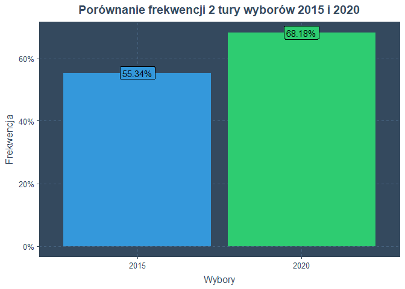
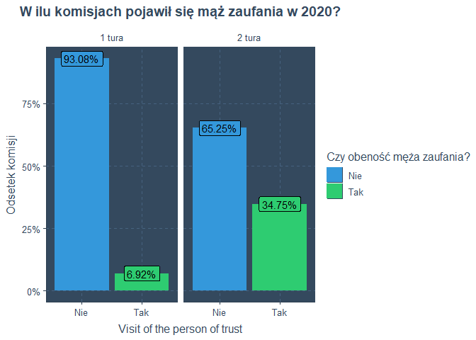
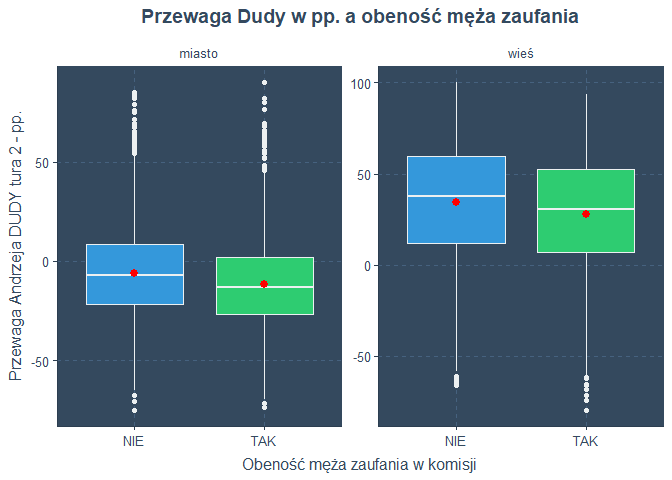
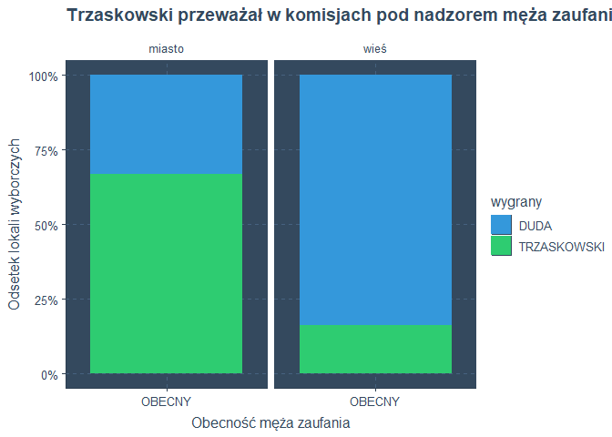
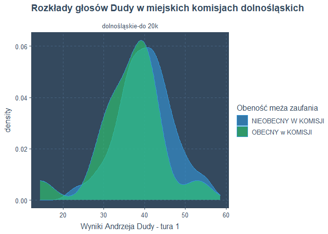
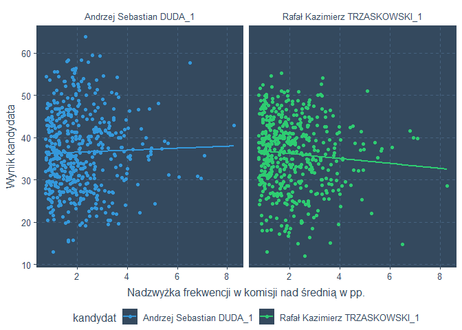
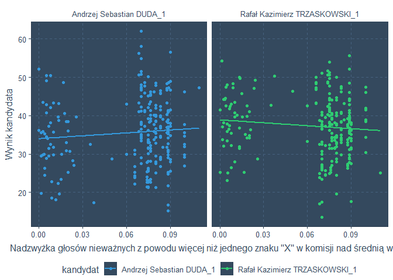
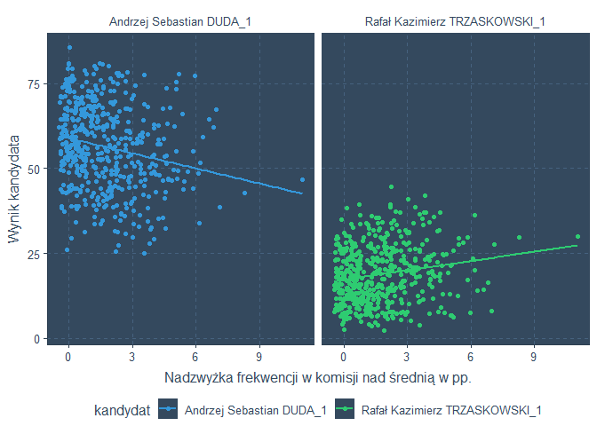

Wpływ mężów zaufania na wyniki wyborów prezydenckich w 2020 roku
================
Wiktor Piela
24.05.2022

### Przedmiot badania

Wybory prezydenckie w Polsce w 2020 roku wyróżniają się pod wieloma
względami od innych tego typu wyborów mających miejsce w Polsce po roku
1989. Na tą wyjątkowość składają sie przede wszystkim poniższe fakty:

-   bardzo mała róznica głosów pomiędzy kandydatami w rozstrzygającej 2
    turze wyborów
-   wysoka frekwencja, jedna z najwyższych dotąd odnotowanych w Polsce
    (co świadczy o skutecznej mobilizacji elektoratu obu kandydatów)
-   duzy przyrost komisji odwiedzonych przez [męża
    zaufania](https://pl.wikipedia.org/wiki/M%C4%85%C5%BC_zaufania)
    pomiędzy pierwszą a drugą turą

#### Szczegóły

##### Niska przewaga zwycięzcy wyborów

Dla porównania - w drugiej turze wyborów, [Andrzej
Duda](https://pl.wikipedia.org/wiki/Andrzej_Duda) wygrał z ubiegającym
sie o reelekcję [Bronisławem
Komorowskim](https://pl.wikipedia.org/wiki/Bronis%C5%82aw_Komorowski)
nieco ponad 500 tysiącami głosów, co stanowiło ponad 3 procent sumy
wszystkich oddanych wówczas głosów. W 2020, [Rafał
Trzaskowski](https://pl.wikipedia.org/wiki/Rafa%C5%82_Trzaskowski)
przegrał o około 400 tysięcy głosów, co jest równowartością nieco ponad
2 procent wszystkich ważnych głosów. Widać zatem, że różnica istotnie
stopaniała na niekorzyść konserwatywnego kandydata.

<table class=" lightable-material lightable-striped lightable-hover" style="font-family: &quot;Source Sans Pro&quot;, helvetica, sans-serif; margin-left: auto; margin-right: auto;">
<thead>
<tr>
<th style="text-align:left;">
Wybory (II tura)
</th>
<th style="text-align:left;">
Andrzej Sebastian DUDA
</th>
<th style="text-align:left;">
KOMOROWSKI/ TRZASKOWSKI
</th>
<th style="text-align:left;">
Suma wszystkich głosów
</th>
<th style="text-align:left;">
Przewaga Andrzeja Dudy
</th>
<th style="text-align:left;">
Udział nadwyżki z głosach ogółem
</th>
</tr>
</thead>
<tbody>
<tr>
<td style="text-align:left;">
2015
</td>
<td style="text-align:left;">
8 630 627
</td>
<td style="text-align:left;">
8 112 311
</td>
<td style="text-align:left;">
16 742 938
</td>
<td style="text-align:left;">
518 316
</td>
<td style="text-align:left;">
3.1%
</td>
</tr>
<tr>
<td style="text-align:left;">
2020
</td>
<td style="text-align:left;">
10 440 388
</td>
<td style="text-align:left;">
10 018 092
</td>
<td style="text-align:left;">
20 458 480
</td>
<td style="text-align:left;">
422 296
</td>
<td style="text-align:left;">
2.06%
</td>
</tr>
</tbody>
</table>

##### Wysoka frekwencja

Frekwencja w 2 turze wyborów prezydenckich 2020 była więkasz o 12.84
punktów procentowych w porównaniu z rokiem 2015. Oznacza to, że w 2020,
zagłosowało o 3 715 542 osób niż 5 lat wczesniej.

##### Obesność męzów zaufania

Podczas pierwszej tury wyborów 2020, mężowie zaufania pojawili się w
1760 komisjach wyborczych, natomiast 2 tygodnie póxniej, podczas drugiej
tury, było już 8839 komisji odwiedzonych przez męża zaufania. To
oznacza, że pomiędzy pierwszą a drugą turą przyrosło 7079 takich komisji
w skali całego kraju.

### Cel badania

Wybory prezydenckie w 2020 r. w ostatecznej turze zakończyły się małą
różnicą przewagi pomiędzy ubiegającym się o reelekcję Andrzejem Dudą a
Rafałem Trzaskowskim. W ich trakcie odnotowano niespotykany wcześniej w
historii polskich wyborów przyrost liczby mężów zaufania, sprawujących
kontrolę nad rzetelnym przeprowadzeniem wyborów. Celem niniejszych badań
było sprawdzenie, czy obecność mężów zaufania mogła mieć wpływ na ich
finalny rezultat. Jeśli tak, to czy w takim razie warto, dla dobra
przyszłych wyborów, popularyzować tą funkcję społeczną na szersza skalę.

### Założenia do badania

Dysponując wynikami wyborów z obu tur z ponad 27 tysięcy komisji
obwodowych w całej Polsce i za granicą, nalezy wybrać populację
badawczą, czyli reprezentacyjny zbiór oberwacji, na którym przeprowadzi
się badanie. W pierwszej kolejności do badania selekcjonuje się te
mające charakter stały (czyli pomija się w tym kroku komisje wyborcze w
aresztach i więzieniach, domach pomocy społecznej, na statkach i za
granicą). Powód takiego doboru populacji do badania wynika wprost z
intuicji – wyniki pochodzące ze specjalnych obwodów wyborczych
wydzielonych w ww. miejscach cechuje brak reprezentatywności,
praktycznie zawsze odróżniają się w sposób znaczny od stałych komisji,
gdzie głosuje całe społeczeństwo, a nie tylko jego część, posiadająca
określone cechy, co bezpośrednio przekłada się na wyniki wyborcze tam
osiągane. Zatem odrzucenie takich obserwacji wydaje się niezbędne,
jeżeli chce się wyciągnąć z analizy wnioski niezaburzone odstającymi
obserwacjami.

Dodatkowo - w zbiorze danych istnieje podział na cztery typy obszarów -
miasto, wieś, obszary miejsko- wiejskie oraz dzielnice Warszawy. Do
badania zostaną wykorzystane obserwacje z miast i wsi, ponieważ wśród
tych rodzajów jest najwięcej obserwacji, a ponadto, jak wprost wynika z
intuicji oraz historii wyborów - mieszańcy obu obszarów cechuje co do
zasady odmienna preferacja polityczna.

### Inferencja przy pomocy parametrów regresji liniowej wielu zmiennych

Udzielenie odpowiedzi na wyżej postawione pytanie, czy obeność męża
zaufania w komisji podczas głosowania faktycznie wpływa na wynik
wyborów, nie jest prosta. Mamy jednak do dyspozycji sporo zmiennych,
głównie ilościowych, opisujących każdą obserwację: oficjalne wyniki
każdego z kandydatów, wartość frekwencji oraz odsetek nieważnych głosów,
a dodatkowo: dane o położeniu geograficznym komisji, liczbie ludności
zamieszkujących gminę, w której znajduje się dana komisja oraz czy gmina
ta jest miejska czy też wiejska. Szukalibyśmy zatem odpowiedzi na
pytanie, jak na wynik konkretnego kandydata wplywały wymienione
czynniki, a miedzy innymi obeność męża zaufania podczas głosowania.
Problem jest dość złożony, a wiennych wiele - zatem z pomocą mogłaby
przyjść regresja liniowa wielu zmiennych, a dzięki parametrom i
istotności statystycznej każdego z predykotów, będzie można ocenić, czy
dostarczone do modelu dane wskazują na wpływ obeności męża zaufania na
wynik któregoś z kandydatów, oczywiścio wobec innych istotnych
statycznie zmiennych.

\*Nie będzie analizowany błąd, dane też nie zostaną podzielone za zbiory
testowy i treningowy, ponieważ model ma za zadanie jedynie wskazać czy
wartości parametrów są zgodne z intuicją oraz czy zostania wykazana
pewna prawidłowość odnośnie obeności męża zaufania w komisji.

Użyte zostaną wyniki II tury wyborów ze zbioru wskazanego w założeniach.
Niech zmienną zależną będzie przewaga Andrzeja Dudy nad Rafałem
Trzaskowskim w punktach procentowych, natomiast predyktorami -
wojwództwo i typ obszaru w jakim mieści się dana komisja (dane o
położeniu geograficznym), a także wynik frekwencji w II turze, odsetek
głosów nieważnych z powodu zostawienia więcej niż jednego znaku “X” przy
na karcie oraz obeność męża zaufania w komisji.

    ## 
    ## Call:
    ## lm(formula = `Przewaga Andrzeja DUDY tura 2` ~ `Typ obszaru` + 
    ##     Województwo + Frekwencja_2 + x2_2 + maz_2, data = do_modelu)
    ## 
    ## Residuals:
    ##      Min       1Q   Median       3Q      Max 
    ## -112.496  -12.685    0.324   13.344   93.231 
    ## 
    ## Coefficients:
    ##                                 Estimate Std. Error t value Pr(>|t|)    
    ## (Intercept)                     43.76112    1.44167  30.354  < 2e-16 ***
    ## `Typ obszaru`wieś               32.43731    0.28461 113.970  < 2e-16 ***
    ## Województwokujawsko-pomorskie   -0.21723    0.72193  -0.301    0.763    
    ## Województwolubelskie            36.23515    0.69677  52.004  < 2e-16 ***
    ## Województwolubuskie            -14.41672    0.94256 -15.295  < 2e-16 ***
    ## Województwołódzkie              23.16875    0.71884  32.231  < 2e-16 ***
    ## Województwomałopolskie          29.53116    0.66653  44.306  < 2e-16 ***
    ## Województwomazowieckie          30.51218    0.65120  46.856  < 2e-16 ***
    ## Województwoopolskie             -8.52719    0.89539  -9.523  < 2e-16 ***
    ## Województwopodkarpackie         43.21551    0.70696  61.129  < 2e-16 ***
    ## Województwopodlaskie            24.04516    0.85005  28.287  < 2e-16 ***
    ## Województwopomorskie            -7.06708    0.75683  -9.338  < 2e-16 ***
    ## Województwośląskie               9.56611    0.64256  14.887  < 2e-16 ***
    ## Województwoświętokrzyskie       31.15075    0.85498  36.435  < 2e-16 ***
    ## Województwowarmińsko-mazurskie  -5.04170    0.82153  -6.137 8.54e-10 ***
    ## Województwowielkopolskie         0.64900    0.67488   0.962    0.336    
    ## Województwozachodniopomorskie   -7.93536    0.81379  -9.751  < 2e-16 ***
    ## Frekwencja_2                    -0.88011    0.02039 -43.171  < 2e-16 ***
    ## x2_2                            -3.66057    0.38209  -9.580  < 2e-16 ***
    ## maz_2TAK                        -4.85723    0.29723 -16.342  < 2e-16 ***
    ## ---
    ## Signif. codes:  0 '***' 0.001 '**' 0.01 '*' 0.05 '.' 0.1 ' ' 1
    ## 
    ## Residual standard error: 20.84 on 24606 degrees of freedom
    ## Multiple R-squared:  0.6268, Adjusted R-squared:  0.6266 
    ## F-statistic:  2175 on 19 and 24606 DF,  p-value: < 2.2e-16

Z tego powodu, że sprawa jest uproszona, a stworzony model jedynie
wskazówką do dalszego badania, w tym momencie jedyną interesującą nas
metryką będzie współczynnik determinacji modelu mówiący o tym jak model
jest dopasowany do danych i jakim stopniu model wyjaśnia badane
zjawisko. W tym przypadku wynosi on 0.63 z przedziału od 0 do 1, czyli
można powiedzieć, że bez dodatkowych modyfikacji oraz tworzenia
dodatkowych cech model dobrze dopasował się do danych i wyjaśnia ok. 63
proc. zmienności, a także że jego parametry są interpretowalne.

### Pierwsze spostrzeżenia

Współczynniki regresji odpowiedające poszczególnym zmiennym są zgodne z
intuicją oraz wiedzą jaką mamy z wyników poprzednich wyborów. Warto
zwrócić uwagę na to, gdzie partie konserwatywne uzyskują zazwyczaj
najwyższe poparcie - są to przede wszystkim obszary wschodniej Polski -
tak też, wartości wspołczynników przy takich województwach jak np.
podkarpackie, podlaskie czy świętokrzyskie mają dużą wartość dodatnią,
co świadczy o tym, że przeciętnie Andrzej Duda uzyskiwał tam dużo wyższą
przewagę nad Rafałem Trzaskowskim. Z kolei, w wojwództwach
zachodniopomorskim, pomorskim, opolskim i lubuskim parametry mają
wartości ujemne, co sugeruje brak przewago kandaydata konserwatywnego na
tych obszarach. Analogicznie w przypadku wsi - jeżeli obszar komisji to
wieś, Duda uzyskuje tam bardzo wysoką przewagę nad kandydatem
liberalnym. Ponadto, prawie wszystkie zmienne są istotne statystycznie
(im t value jest bardziej różne od zera, tym bardziej istotna jest
zmienna), co oznacza, że z wysokim prawdopodobieństem można stwierdzić,
że mają one wpływ na wartość zmiennej zależnej.

Estymacja parametrów tego modelu wskazuje, że obecność męża zaufania
jest istotna statystycznie i wpływa na niekorzyść Andrzeja Dudy -
ponieważ średnio jeżeli w danej komisji był mąż zaufania w 2 turze, to
ubiegający się o reelekcję prezydent uzyskiwał niższą o prawie 5
pp. przewagę nad przeciwnikiem. Czy można zatem powiedzieć, że obecność
męża zaufania wpłyneła na wynik wyborów, ponieważ dzięki temu unikęto
nieuczciwych praktyk mających na celu wypromowanie którego z kandydatów
?

### Dlaczego ten model jest zły?

Istotny jest tutaj związek przyczynowo-skutkowy i należy rozważyć dwie
sytuacje:

-   obeność męża zaufania zadziałała na korzyść wyniku Trzaskowskiego,
    ponieważ zaniechano ewentualnych nadużyć
-   więcej było mężów zaufania tam, gdzie Trzaskowski ma wyższe
    poparcie, bo elektorat liberalny bardziej obawiał się potencjalnych
    nadużyć

Sama intuicja i podstawowa wiedza na temat polskiego życia politycznego
ostatnich lat każe obstać za drugą opcją. Dane ukazują nastepujące
zależności:

    ##   maz_2    min    Q1 median    Q3    max     mean       sd     n missing
    ## 1   NIE -66.00 12.20   37.5 59.36 100.00 34.41573 30.60672 10022       0
    ## 2   TAK -79.62  6.97   30.7 52.42  93.54 27.84556 31.48594  3275       0

    ##   maz_2    min     Q1 median   Q3   max       mean       sd    n missing
    ## 1   NIE -75.04 -21.79  -7.14 8.46 84.88  -5.978705 21.87120 6364       0
    ## 2   TAK -73.64 -26.92 -13.08 1.94 89.94 -11.745575 21.66586 4965       0

Na wsiach, w komisjach, gdzie w 2 turze nie było mężów zaufania,
przewaga Dudy nad Trzaskowskim wynosiła przeciętnie prawie 36 pp.,
natomiast tam, dzie ich nie było - ta przewaga była równa przeciętnie
już około 31 pp. Analogicznie jeśli chodzi o miasta - Duda tracił do
Trzaskowskiego średnio 7.15 pp. w komisjach bez męża zaufania, ale tam
gdzie się on pojawił, różnica wyniosła ponad 13 pp. straty do
liberalnego kandydata.

Dodatkowo, takiej zależności, można dowodzić w podobnym ujęciu:

<table class=" lightable-material lightable-striped lightable-hover" style="font-family: &quot;Source Sans Pro&quot;, helvetica, sans-serif; margin-left: auto; margin-right: auto;">
<thead>
<tr>
<th style="empty-cells: hide;" colspan="1">
</th>
<th style="padding-bottom:0; padding-left:3px;padding-right:3px;text-align: center; " colspan="1">

Cała Polska

</th>
<th style="empty-cells: hide;" colspan="1">
</th>
</tr>
<tr>
<th style="text-align:left;">
wygrany
</th>
<th style="text-align:left;">
NIEOBECNY
</th>
<th style="text-align:left;">
OBECNY
</th>
</tr>
</thead>
<tbody>
<tr>
<td style="text-align:left;">
DUDA
</td>
<td style="text-align:left;">
66.48%
</td>
<td style="text-align:left;">
48.88%
</td>
</tr>
<tr>
<td style="text-align:left;">
TRZASKOWSKI
</td>
<td style="text-align:left;">
33.52%
</td>
<td style="text-align:left;">
51.12%
</td>
</tr>
</tbody>
</table>

W skali całej Polski, w drugiej turze Rafał Trzaskowski wygrał w tylko
nieco ponad co trzeciej komisji, gdzie mąż zaufania podczas drugiej tury
nie pojawił się. W przypadku komisji przez niego odwiedzonych,
Trzaskowski wygrywał w ponad połowie.

Analogicznie w rozbiciu na wsie i miasta - jeśli mielibysmy wskazać,
gdzie Trzaskowski wygra z wiekszym prawdopodobieństwem, zawsze odpowiedż
pada na komisję z mężem zaufania.

<table class=" lightable-material lightable-striped lightable-hover" style="font-family: &quot;Source Sans Pro&quot;, helvetica, sans-serif; margin-left: auto; margin-right: auto;">
<thead>
<tr>
<th style="empty-cells: hide;" colspan="1">
</th>
<th style="padding-bottom:0; padding-left:3px;padding-right:3px;text-align: center; " colspan="1">

Obszary wiejskie

</th>
<th style="empty-cells: hide;" colspan="1">
</th>
</tr>
<tr>
<th style="text-align:left;">
wygrany
</th>
<th style="text-align:left;">
NIEOBECNY
</th>
<th style="text-align:left;">
OBECNY
</th>
</tr>
</thead>
<tbody>
<tr>
<td style="text-align:left;">
DUDA
</td>
<td style="text-align:left;">
84.93%
</td>
<td style="text-align:left;">
80.85%
</td>
</tr>
<tr>
<td style="text-align:left;">
TRZASKOWSKI
</td>
<td style="text-align:left;">
15.07%
</td>
<td style="text-align:left;">
19.15%
</td>
</tr>
</tbody>
</table>
<table>
<thead>
<tr>
<th style="empty-cells: hide;border-bottom:hidden;" colspan="1">
</th>
<th style="border-bottom:hidden;padding-bottom:0; padding-left:3px;padding-right:3px;text-align: center; " colspan="1">

Miasta

</th>
<th style="empty-cells: hide;border-bottom:hidden;" colspan="1">
</th>
</tr>
<tr>
<th style="text-align:left;">
wygrany
</th>
<th style="text-align:left;">
NIEOBECNY
</th>
<th style="text-align:left;">
OBECNY
</th>
</tr>
</thead>
<tbody>
<tr>
<td style="text-align:left;">
DUDA
</td>
<td style="text-align:left;">
37.41%
</td>
<td style="text-align:left;">
27.79%
</td>
</tr>
<tr>
<td style="text-align:left;">
TRZASKOWSKI
</td>
<td style="text-align:left;">
62.59%
</td>
<td style="text-align:left;">
72.21%
</td>
</tr>
</tbody>
</table>

Co oznacza to zjawisko? - Na pewno jest jest ani zbiegiem okoliczności.
Czy zatem ponad 8000 mężów zaufania nadużywało w jakiś sposób swojej
obecności i razem z komisjami wyborczymi faworyzowali Rafała
Trzaskowskiego? Oba stwierdzenia sa równie absurdalne, a odpowiedź
prosta. To właśnie liberalny elektorat bardziej obawiał sie o uczciwość
przeprowadzonych wyborów i na tych obszarach, gdzie jest go więcej niz
konserwatywnego, zglaszało się więcej chętnych do zostania mężem
zaufania w II turze wyborów. Właśnie dlatego tak bezrefleksyjne
zawierzenie modelowi mogłoby prowadzić do błędnych wniosków.

### Porównanie rozkładłów głosów

Jeżeli któryś z kandydatów byłby faworyzowany, to w I turze powinien
uzyskiwać przeciętnie lepsze wyniki w komisjach bez męża zaufania niż w
podobnych komisjach odwiedzonych przez męża zaufania. Do tego potrzeba
rozkładu referencyjnego, aby sprawdzić, czy wyniki danego kandydata z
komisji bez męża zaufania odchylają sie w pewien znaczący sposób od
normy z danego regionu. W tym celu wszystki badane komisje obwodowe
zostaną pogrupowane wg kryterium typu obszaru, województwa oraz
wielkości gminy, w którym sie znajdują.

Wśród każdej grupy wyodrębnione zostaną dwa zbiory komisji - bez męża
zaufania oraz z. W każdym z regionów porównane zostaną rozkłady głosów
na kandydata z obu zbiorów komisji (sprawdzimy czy różnią się one
istotnie od siebie). Do tego celu zostanie przeprowadzony test
Kołmogorowa-Smirnowa o hipotezie zerowej, że oba rozkłady pochodzą z tej
samej populacji. W każdym przypadku wynik testu powinien wskazać, że
rozkłady są takie same, ponieważ de facto pochodzą z tego samego
regionu, a zarazem tej samej populacji, różni je jedynie to, że w
jednych był obecny mąż zaufania w I turze wyborów, a w innych nie. W
pozostałych względach są podobne, bo pochodzą z tego samego typu
obszaru, tego samego województwa i ze zbioru innych komisji z gmin o
podobnej wielkości w liczbie mieszkańców. Jeśli zatem prawdopodobieństwo
odrzucenia hipotezy zerowej będzie wystarczająco wysokie, powinno to
prowadzić do skupienia się na tych podejrzanych grupach.

#### Miasta

Komisje miejskie zostały podzielone wg województw oraz wielkości gmin w
których się znajdują - poniżej kompletna lista wszystkich grup łącznie z
informacją ile komisji każda z nich zawiera:

<table class="table table-striped" style="margin-left: auto; margin-right: auto;">
<thead>
<tr>
<th style="text-align:left;position: sticky; top:0; background-color: #FFFFFF;">
region
</th>
<th style="text-align:right;position: sticky; top:0; background-color: #FFFFFF;">
n
</th>
</tr>
</thead>
<tbody>
<tr>
<td style="text-align:left;">
dolnośląskie-do 20k
</td>
<td style="text-align:right;">
386
</td>
</tr>
<tr>
<td style="text-align:left;">
dolnośląskie-pow. 100k-500k
</td>
<td style="text-align:right;">
282
</td>
</tr>
<tr>
<td style="text-align:left;">
dolnośląskie-pow. 20k-100k
</td>
<td style="text-align:right;">
381
</td>
</tr>
<tr>
<td style="text-align:left;">
kujawsko-pomorskie-do 20k
</td>
<td style="text-align:right;">
283
</td>
</tr>
<tr>
<td style="text-align:left;">
kujawsko-pomorskie-pow. 100k-500k
</td>
<td style="text-align:right;">
301
</td>
</tr>
<tr>
<td style="text-align:left;">
kujawsko-pomorskie-pow. 20k-100k
</td>
<td style="text-align:right;">
172
</td>
</tr>
<tr>
<td style="text-align:left;">
lubelskie-do 20k
</td>
<td style="text-align:right;">
189
</td>
</tr>
<tr>
<td style="text-align:left;">
lubelskie-pow. 100k-500k
</td>
<td style="text-align:right;">
188
</td>
</tr>
<tr>
<td style="text-align:left;">
lubelskie-pow. 20k-100k
</td>
<td style="text-align:right;">
190
</td>
</tr>
<tr>
<td style="text-align:left;">
lubuskie-do 20k
</td>
<td style="text-align:right;">
189
</td>
</tr>
<tr>
<td style="text-align:left;">
lubuskie-pow. 100k-500k
</td>
<td style="text-align:right;">
72
</td>
</tr>
<tr>
<td style="text-align:left;">
lubuskie-pow. 20k-100k
</td>
<td style="text-align:right;">
101
</td>
</tr>
<tr>
<td style="text-align:left;">
łódzkie-do 20k
</td>
<td style="text-align:right;">
191
</td>
</tr>
<tr>
<td style="text-align:left;">
łódzkie-pow. 20k-100k
</td>
<td style="text-align:right;">
285
</td>
</tr>
<tr>
<td style="text-align:left;">
łódzkie-pow. 500k
</td>
<td style="text-align:right;">
283
</td>
</tr>
<tr>
<td style="text-align:left;">
małopolskie-do 20k
</td>
<td style="text-align:right;">
270
</td>
</tr>
<tr>
<td style="text-align:left;">
małopolskie-pow. 20k-100k
</td>
<td style="text-align:right;">
249
</td>
</tr>
<tr>
<td style="text-align:left;">
małopolskie-pow. 500k
</td>
<td style="text-align:right;">
405
</td>
</tr>
<tr>
<td style="text-align:left;">
mazowieckie-do 20k
</td>
<td style="text-align:right;">
402
</td>
</tr>
<tr>
<td style="text-align:left;">
mazowieckie-pow. 100k-500k
</td>
<td style="text-align:right;">
109
</td>
</tr>
<tr>
<td style="text-align:left;">
mazowieckie-pow. 20k-100k
</td>
<td style="text-align:right;">
417
</td>
</tr>
<tr>
<td style="text-align:left;">
opolskie-do 20k
</td>
<td style="text-align:right;">
161
</td>
</tr>
<tr>
<td style="text-align:left;">
opolskie-pow. 20k-100k
</td>
<td style="text-align:right;">
143
</td>
</tr>
<tr>
<td style="text-align:left;">
podkarpackie-do 20k
</td>
<td style="text-align:right;">
176
</td>
</tr>
<tr>
<td style="text-align:left;">
podkarpackie-pow. 100k-500k
</td>
<td style="text-align:right;">
89
</td>
</tr>
<tr>
<td style="text-align:left;">
podkarpackie-pow. 20k-100k
</td>
<td style="text-align:right;">
239
</td>
</tr>
<tr>
<td style="text-align:left;">
podlaskie-do 20k
</td>
<td style="text-align:right;">
162
</td>
</tr>
<tr>
<td style="text-align:left;">
podlaskie-pow. 100k-500k
</td>
<td style="text-align:right;">
170
</td>
</tr>
<tr>
<td style="text-align:left;">
podlaskie-pow. 20k-100k
</td>
<td style="text-align:right;">
83
</td>
</tr>
<tr>
<td style="text-align:left;">
pomorskie-do 20k
</td>
<td style="text-align:right;">
153
</td>
</tr>
<tr>
<td style="text-align:left;">
pomorskie-pow. 100k-500k
</td>
<td style="text-align:right;">
297
</td>
</tr>
<tr>
<td style="text-align:left;">
pomorskie-pow. 20k-100k
</td>
<td style="text-align:right;">
244
</td>
</tr>
<tr>
<td style="text-align:left;">
śląskie-do 20k
</td>
<td style="text-align:right;">
239
</td>
</tr>
<tr>
<td style="text-align:left;">
śląskie-pow. 100k-500k
</td>
<td style="text-align:right;">
832
</td>
</tr>
<tr>
<td style="text-align:left;">
śląskie-pow. 20k-100k
</td>
<td style="text-align:right;">
701
</td>
</tr>
<tr>
<td style="text-align:left;">
świętokrzyskie-do 20k
</td>
<td style="text-align:right;">
120
</td>
</tr>
<tr>
<td style="text-align:left;">
świętokrzyskie-pow. 100k-500k
</td>
<td style="text-align:right;">
83
</td>
</tr>
<tr>
<td style="text-align:left;">
świętokrzyskie-pow. 20k-100k
</td>
<td style="text-align:right;">
85
</td>
</tr>
<tr>
<td style="text-align:left;">
warmińsko-mazurskie-do 20k
</td>
<td style="text-align:right;">
227
</td>
</tr>
<tr>
<td style="text-align:left;">
warmińsko-mazurskie-pow. 100k-500k
</td>
<td style="text-align:right;">
87
</td>
</tr>
<tr>
<td style="text-align:left;">
warmińsko-mazurskie-pow. 20k-100k
</td>
<td style="text-align:right;">
133
</td>
</tr>
<tr>
<td style="text-align:left;">
wielkopolskie-do 20k
</td>
<td style="text-align:right;">
391
</td>
</tr>
<tr>
<td style="text-align:left;">
wielkopolskie-pow. 100k-500k
</td>
<td style="text-align:right;">
227
</td>
</tr>
<tr>
<td style="text-align:left;">
wielkopolskie-pow. 20k-100k
</td>
<td style="text-align:right;">
326
</td>
</tr>
<tr>
<td style="text-align:left;">
zachodniopomorskie-do 20k
</td>
<td style="text-align:right;">
256
</td>
</tr>
<tr>
<td style="text-align:left;">
zachodniopomorskie-pow. 100k-500k
</td>
<td style="text-align:right;">
192
</td>
</tr>
<tr>
<td style="text-align:left;">
zachodniopomorskie-pow. 20k-100k
</td>
<td style="text-align:right;">
168
</td>
</tr>
</tbody>
</table>

Przykładowo - komisje znajdujące się w Oławie będą należały do grupy
dolnoślaskich komisji miejskich o wielkości od 20 do 100 tys.
mieszkańców.

Poniżej - sprawdzenie rozkładów głosów uzyskanych przez Andrzeja Dudę w
pierwszej turze we wszystkich komisjach miejskich na Dolnym Śląsku
znajdujących się z małych gminach (liczba mieszkańców do 20 tys.)

    ## 
    ##  Two-sample Kolmogorov-Smirnov test
    ## 
    ## data:  x$`Andrzej Sebastian DUDA_1` and y$`Andrzej Sebastian DUDA_1`
    ## D = 0.04147, p-value = 0.08307
    ## alternative hypothesis: two-sided

Wiemy, że głosy zarówno z komisji bez mężów zaufania jak i z ich wizytą
pochodzą z tej samej populacji. Test zwraca prawdopodobieństwo
odbrzucenia hipotezy zerowej równe 0.08307, co oznacza, że z powszechnie
przyjętą konwencją (\<0.05) jest wartością zbyt wysoką,a by H0 odrzucić.

Pamiętajmy, że mamy do przetestowania 47 grup więc będziemy mieć do
czynienia z **błędem wielokrotnego testowania**, co oznacza, że
statystycznie rzecz biorąc, znajdzie się grupa, gdzie test zwróci na tle
małe p-value, aby przyjąć hipotezę alternatywną, dlatego do otrzymanych
wartości trzeba będzie podejść bardziej rygorystycznie niż przewiduje
powszechna konwencja i zwracac uwage tylko na naprawdę bardzo niskie
p-value.

<table class="table table-striped" style="margin-left: auto; margin-right: auto;">
<thead>
<tr>
<th style="text-align:left;position: sticky; top:0; background-color: #FFFFFF;">
Regiony
</th>
<th style="text-align:right;position: sticky; top:0; background-color: #FFFFFF;">
p-value
</th>
<th style="text-align:right;position: sticky; top:0; background-color: #FFFFFF;">
liczebność komisji bez męża zaufania
</th>
<th style="text-align:right;position: sticky; top:0; background-color: #FFFFFF;">
liczebnosc komisji z mężem zaufania
</th>
<th style="text-align:right;position: sticky; top:0; background-color: #FFFFFF;">
liczebność komisji total w regionie
</th>
<th style="text-align:left;position: sticky; top:0; background-color: #FFFFFF;">
odestek komisji z mężem zaufania
</th>
<th style="text-align:left;position: sticky; top:0; background-color: #FFFFFF;">
hipoteza
</th>
</tr>
</thead>
<tbody>
<tr>
<td style="text-align:left;">
dolnośląskie-pow. 20k-100k
</td>
<td style="text-align:right;">
0.1218046
</td>
<td style="text-align:right;">
333
</td>
<td style="text-align:right;">
48
</td>
<td style="text-align:right;">
381
</td>
<td style="text-align:left;">
12.6%
</td>
<td style="text-align:left;">
H0
</td>
</tr>
<tr>
<td style="text-align:left;">
dolnośląskie-do 20k
</td>
<td style="text-align:right;">
0.0642442
</td>
<td style="text-align:right;">
370
</td>
<td style="text-align:right;">
16
</td>
<td style="text-align:right;">
386
</td>
<td style="text-align:left;">
4.15%
</td>
<td style="text-align:left;">
H0
</td>
</tr>
<tr>
<td style="text-align:left;">
dolnośląskie-pow. 100k-500k
</td>
<td style="text-align:right;">
0.4531489
</td>
<td style="text-align:right;">
257
</td>
<td style="text-align:right;">
25
</td>
<td style="text-align:right;">
282
</td>
<td style="text-align:left;">
8.87%
</td>
<td style="text-align:left;">
H0
</td>
</tr>
<tr>
<td style="text-align:left;">
kujawsko-pomorskie-do 20k
</td>
<td style="text-align:right;">
0.7694455
</td>
<td style="text-align:right;">
274
</td>
<td style="text-align:right;">
9
</td>
<td style="text-align:right;">
283
</td>
<td style="text-align:left;">
3.18%
</td>
<td style="text-align:left;">
H0
</td>
</tr>
<tr>
<td style="text-align:left;">
kujawsko-pomorskie-pow. 20k-100k
</td>
<td style="text-align:right;">
0.1736261
</td>
<td style="text-align:right;">
145
</td>
<td style="text-align:right;">
27
</td>
<td style="text-align:right;">
172
</td>
<td style="text-align:left;">
15.7%
</td>
<td style="text-align:left;">
H0
</td>
</tr>
<tr>
<td style="text-align:left;">
kujawsko-pomorskie-pow. 100k-500k
</td>
<td style="text-align:right;">
0.3362980
</td>
<td style="text-align:right;">
293
</td>
<td style="text-align:right;">
8
</td>
<td style="text-align:right;">
301
</td>
<td style="text-align:left;">
2.66%
</td>
<td style="text-align:left;">
H0
</td>
</tr>
<tr>
<td style="text-align:left;">
lubelskie-do 20k
</td>
<td style="text-align:right;">
0.1344168
</td>
<td style="text-align:right;">
174
</td>
<td style="text-align:right;">
15
</td>
<td style="text-align:right;">
189
</td>
<td style="text-align:left;">
7.94%
</td>
<td style="text-align:left;">
H0
</td>
</tr>
<tr>
<td style="text-align:left;">
lubelskie-pow. 20k-100k
</td>
<td style="text-align:right;">
0.0403938
</td>
<td style="text-align:right;">
136
</td>
<td style="text-align:right;">
54
</td>
<td style="text-align:right;">
190
</td>
<td style="text-align:left;">
28.42%
</td>
<td style="text-align:left;">
H1
</td>
</tr>
<tr>
<td style="text-align:left;">
lubelskie-pow. 100k-500k
</td>
<td style="text-align:right;">
0.6214453
</td>
<td style="text-align:right;">
180
</td>
<td style="text-align:right;">
8
</td>
<td style="text-align:right;">
188
</td>
<td style="text-align:left;">
4.26%
</td>
<td style="text-align:left;">
H0
</td>
</tr>
<tr>
<td style="text-align:left;">
lubuskie-do 20k
</td>
<td style="text-align:right;">
0.8717661
</td>
<td style="text-align:right;">
187
</td>
<td style="text-align:right;">
2
</td>
<td style="text-align:right;">
189
</td>
<td style="text-align:left;">
1.06%
</td>
<td style="text-align:left;">
H0
</td>
</tr>
<tr>
<td style="text-align:left;">
lubuskie-pow. 20k-100k
</td>
<td style="text-align:right;">
0.6295083
</td>
<td style="text-align:right;">
98
</td>
<td style="text-align:right;">
3
</td>
<td style="text-align:right;">
101
</td>
<td style="text-align:left;">
2.97%
</td>
<td style="text-align:left;">
H0
</td>
</tr>
<tr>
<td style="text-align:left;">
lubuskie-pow. 100k-500k
</td>
<td style="text-align:right;">
0.9939622
</td>
<td style="text-align:right;">
57
</td>
<td style="text-align:right;">
15
</td>
<td style="text-align:right;">
72
</td>
<td style="text-align:left;">
20.83%
</td>
<td style="text-align:left;">
H0
</td>
</tr>
<tr>
<td style="text-align:left;">
łódzkie-pow. 20k-100k
</td>
<td style="text-align:right;">
0.1303721
</td>
<td style="text-align:right;">
246
</td>
<td style="text-align:right;">
39
</td>
<td style="text-align:right;">
285
</td>
<td style="text-align:left;">
13.68%
</td>
<td style="text-align:left;">
H0
</td>
</tr>
<tr>
<td style="text-align:left;">
łódzkie-do 20k
</td>
<td style="text-align:right;">
0.1760731
</td>
<td style="text-align:right;">
162
</td>
<td style="text-align:right;">
29
</td>
<td style="text-align:right;">
191
</td>
<td style="text-align:left;">
15.18%
</td>
<td style="text-align:left;">
H0
</td>
</tr>
<tr>
<td style="text-align:left;">
łódzkie-pow. 500k
</td>
<td style="text-align:right;">
0.9215386
</td>
<td style="text-align:right;">
239
</td>
<td style="text-align:right;">
44
</td>
<td style="text-align:right;">
283
</td>
<td style="text-align:left;">
15.55%
</td>
<td style="text-align:left;">
H0
</td>
</tr>
<tr>
<td style="text-align:left;">
małopolskie-pow. 20k-100k
</td>
<td style="text-align:right;">
0.7522111
</td>
<td style="text-align:right;">
232
</td>
<td style="text-align:right;">
17
</td>
<td style="text-align:right;">
249
</td>
<td style="text-align:left;">
6.83%
</td>
<td style="text-align:left;">
H0
</td>
</tr>
<tr>
<td style="text-align:left;">
małopolskie-do 20k
</td>
<td style="text-align:right;">
0.6856177
</td>
<td style="text-align:right;">
258
</td>
<td style="text-align:right;">
12
</td>
<td style="text-align:right;">
270
</td>
<td style="text-align:left;">
4.44%
</td>
<td style="text-align:left;">
H0
</td>
</tr>
<tr>
<td style="text-align:left;">
małopolskie-pow. 500k
</td>
<td style="text-align:right;">
0.0071744
</td>
<td style="text-align:right;">
364
</td>
<td style="text-align:right;">
41
</td>
<td style="text-align:right;">
405
</td>
<td style="text-align:left;">
10.12%
</td>
<td style="text-align:left;">
H1
</td>
</tr>
<tr>
<td style="text-align:left;">
mazowieckie-do 20k
</td>
<td style="text-align:right;">
0.0279697
</td>
<td style="text-align:right;">
332
</td>
<td style="text-align:right;">
70
</td>
<td style="text-align:right;">
402
</td>
<td style="text-align:left;">
17.41%
</td>
<td style="text-align:left;">
H1
</td>
</tr>
<tr>
<td style="text-align:left;">
mazowieckie-pow. 20k-100k
</td>
<td style="text-align:right;">
0.2147859
</td>
<td style="text-align:right;">
366
</td>
<td style="text-align:right;">
51
</td>
<td style="text-align:right;">
417
</td>
<td style="text-align:left;">
12.23%
</td>
<td style="text-align:left;">
H0
</td>
</tr>
<tr>
<td style="text-align:left;">
mazowieckie-pow. 100k-500k
</td>
<td style="text-align:right;">
0.3814612
</td>
<td style="text-align:right;">
92
</td>
<td style="text-align:right;">
17
</td>
<td style="text-align:right;">
109
</td>
<td style="text-align:left;">
15.6%
</td>
<td style="text-align:left;">
H0
</td>
</tr>
<tr>
<td style="text-align:left;">
opolskie-pow. 20k-100k
</td>
<td style="text-align:right;">
0.6903569
</td>
<td style="text-align:right;">
135
</td>
<td style="text-align:right;">
8
</td>
<td style="text-align:right;">
143
</td>
<td style="text-align:left;">
5.59%
</td>
<td style="text-align:left;">
H0
</td>
</tr>
<tr>
<td style="text-align:left;">
opolskie-do 20k
</td>
<td style="text-align:right;">
0.0003739
</td>
<td style="text-align:right;">
141
</td>
<td style="text-align:right;">
20
</td>
<td style="text-align:right;">
161
</td>
<td style="text-align:left;">
12.42%
</td>
<td style="text-align:left;">
H1
</td>
</tr>
<tr>
<td style="text-align:left;">
podkarpackie-do 20k
</td>
<td style="text-align:right;">
0.2325544
</td>
<td style="text-align:right;">
153
</td>
<td style="text-align:right;">
23
</td>
<td style="text-align:right;">
176
</td>
<td style="text-align:left;">
13.07%
</td>
<td style="text-align:left;">
H0
</td>
</tr>
<tr>
<td style="text-align:left;">
podkarpackie-pow. 20k-100k
</td>
<td style="text-align:right;">
0.3242721
</td>
<td style="text-align:right;">
211
</td>
<td style="text-align:right;">
28
</td>
<td style="text-align:right;">
239
</td>
<td style="text-align:left;">
11.72%
</td>
<td style="text-align:left;">
H0
</td>
</tr>
<tr>
<td style="text-align:left;">
podkarpackie-pow. 100k-500k
</td>
<td style="text-align:right;">
0.3047493
</td>
<td style="text-align:right;">
83
</td>
<td style="text-align:right;">
6
</td>
<td style="text-align:right;">
89
</td>
<td style="text-align:left;">
6.74%
</td>
<td style="text-align:left;">
H0
</td>
</tr>
<tr>
<td style="text-align:left;">
podlaskie-do 20k
</td>
<td style="text-align:right;">
0.8122450
</td>
<td style="text-align:right;">
159
</td>
<td style="text-align:right;">
3
</td>
<td style="text-align:right;">
162
</td>
<td style="text-align:left;">
1.85%
</td>
<td style="text-align:left;">
H0
</td>
</tr>
<tr>
<td style="text-align:left;">
podlaskie-pow. 100k-500k
</td>
<td style="text-align:right;">
0.0124446
</td>
<td style="text-align:right;">
159
</td>
<td style="text-align:right;">
11
</td>
<td style="text-align:right;">
170
</td>
<td style="text-align:left;">
6.47%
</td>
<td style="text-align:left;">
H1
</td>
</tr>
<tr>
<td style="text-align:left;">
pomorskie-do 20k
</td>
<td style="text-align:right;">
0.1998352
</td>
<td style="text-align:right;">
149
</td>
<td style="text-align:right;">
4
</td>
<td style="text-align:right;">
153
</td>
<td style="text-align:left;">
2.61%
</td>
<td style="text-align:left;">
H0
</td>
</tr>
<tr>
<td style="text-align:left;">
pomorskie-pow. 20k-100k
</td>
<td style="text-align:right;">
0.0308754
</td>
<td style="text-align:right;">
208
</td>
<td style="text-align:right;">
36
</td>
<td style="text-align:right;">
244
</td>
<td style="text-align:left;">
14.75%
</td>
<td style="text-align:left;">
H1
</td>
</tr>
<tr>
<td style="text-align:left;">
pomorskie-pow. 100k-500k
</td>
<td style="text-align:right;">
0.0905901
</td>
<td style="text-align:right;">
276
</td>
<td style="text-align:right;">
21
</td>
<td style="text-align:right;">
297
</td>
<td style="text-align:left;">
7.07%
</td>
<td style="text-align:left;">
H0
</td>
</tr>
<tr>
<td style="text-align:left;">
śląskie-pow. 20k-100k
</td>
<td style="text-align:right;">
0.1296608
</td>
<td style="text-align:right;">
655
</td>
<td style="text-align:right;">
46
</td>
<td style="text-align:right;">
701
</td>
<td style="text-align:left;">
6.56%
</td>
<td style="text-align:left;">
H0
</td>
</tr>
<tr>
<td style="text-align:left;">
śląskie-do 20k
</td>
<td style="text-align:right;">
0.2537480
</td>
<td style="text-align:right;">
234
</td>
<td style="text-align:right;">
5
</td>
<td style="text-align:right;">
239
</td>
<td style="text-align:left;">
2.09%
</td>
<td style="text-align:left;">
H0
</td>
</tr>
<tr>
<td style="text-align:left;">
śląskie-pow. 100k-500k
</td>
<td style="text-align:right;">
0.0877731
</td>
<td style="text-align:right;">
798
</td>
<td style="text-align:right;">
34
</td>
<td style="text-align:right;">
832
</td>
<td style="text-align:left;">
4.09%
</td>
<td style="text-align:left;">
H0
</td>
</tr>
<tr>
<td style="text-align:left;">
świętokrzyskie-do 20k
</td>
<td style="text-align:right;">
0.4663612
</td>
<td style="text-align:right;">
98
</td>
<td style="text-align:right;">
22
</td>
<td style="text-align:right;">
120
</td>
<td style="text-align:left;">
18.33%
</td>
<td style="text-align:left;">
H0
</td>
</tr>
<tr>
<td style="text-align:left;">
świętokrzyskie-pow. 20k-100k
</td>
<td style="text-align:right;">
0.5363815
</td>
<td style="text-align:right;">
72
</td>
<td style="text-align:right;">
13
</td>
<td style="text-align:right;">
85
</td>
<td style="text-align:left;">
15.29%
</td>
<td style="text-align:left;">
H0
</td>
</tr>
<tr>
<td style="text-align:left;">
świętokrzyskie-pow. 100k-500k
</td>
<td style="text-align:right;">
0.5734794
</td>
<td style="text-align:right;">
74
</td>
<td style="text-align:right;">
9
</td>
<td style="text-align:right;">
83
</td>
<td style="text-align:left;">
10.84%
</td>
<td style="text-align:left;">
H0
</td>
</tr>
<tr>
<td style="text-align:left;">
warmińsko-mazurskie-do 20k
</td>
<td style="text-align:right;">
0.0748221
</td>
<td style="text-align:right;">
212
</td>
<td style="text-align:right;">
15
</td>
<td style="text-align:right;">
227
</td>
<td style="text-align:left;">
6.61%
</td>
<td style="text-align:left;">
H0
</td>
</tr>
<tr>
<td style="text-align:left;">
warmińsko-mazurskie-pow. 20k-100k
</td>
<td style="text-align:right;">
0.5440687
</td>
<td style="text-align:right;">
122
</td>
<td style="text-align:right;">
11
</td>
<td style="text-align:right;">
133
</td>
<td style="text-align:left;">
8.27%
</td>
<td style="text-align:left;">
H0
</td>
</tr>
<tr>
<td style="text-align:left;">
warmińsko-mazurskie-pow. 100k-500k
</td>
<td style="text-align:right;">
0.8231335
</td>
<td style="text-align:right;">
65
</td>
<td style="text-align:right;">
22
</td>
<td style="text-align:right;">
87
</td>
<td style="text-align:left;">
25.29%
</td>
<td style="text-align:left;">
H0
</td>
</tr>
<tr>
<td style="text-align:left;">
wielkopolskie-do 20k
</td>
<td style="text-align:right;">
0.2427808
</td>
<td style="text-align:right;">
370
</td>
<td style="text-align:right;">
21
</td>
<td style="text-align:right;">
391
</td>
<td style="text-align:left;">
5.37%
</td>
<td style="text-align:left;">
H0
</td>
</tr>
<tr>
<td style="text-align:left;">
wielkopolskie-pow. 20k-100k
</td>
<td style="text-align:right;">
0.8748121
</td>
<td style="text-align:right;">
304
</td>
<td style="text-align:right;">
22
</td>
<td style="text-align:right;">
326
</td>
<td style="text-align:left;">
6.75%
</td>
<td style="text-align:left;">
H0
</td>
</tr>
<tr>
<td style="text-align:left;">
wielkopolskie-pow. 100k-500k
</td>
<td style="text-align:right;">
0.8650516
</td>
<td style="text-align:right;">
206
</td>
<td style="text-align:right;">
21
</td>
<td style="text-align:right;">
227
</td>
<td style="text-align:left;">
9.25%
</td>
<td style="text-align:left;">
H0
</td>
</tr>
<tr>
<td style="text-align:left;">
zachodniopomorskie-do 20k
</td>
<td style="text-align:right;">
0.3141994
</td>
<td style="text-align:right;">
244
</td>
<td style="text-align:right;">
12
</td>
<td style="text-align:right;">
256
</td>
<td style="text-align:left;">
4.69%
</td>
<td style="text-align:left;">
H0
</td>
</tr>
<tr>
<td style="text-align:left;">
zachodniopomorskie-pow. 20k-100k
</td>
<td style="text-align:right;">
0.0270117
</td>
<td style="text-align:right;">
121
</td>
<td style="text-align:right;">
47
</td>
<td style="text-align:right;">
168
</td>
<td style="text-align:left;">
27.98%
</td>
<td style="text-align:left;">
H1
</td>
</tr>
<tr>
<td style="text-align:left;">
zachodniopomorskie-pow. 100k-500k
</td>
<td style="text-align:right;">
0.3484866
</td>
<td style="text-align:right;">
186
</td>
<td style="text-align:right;">
6
</td>
<td style="text-align:right;">
192
</td>
<td style="text-align:left;">
3.12%
</td>
<td style="text-align:left;">
H0
</td>
</tr>
</tbody>
</table>

Choć w przypadku niektórych testów, uzyskana wartość p jest niższa od
0.05 to jednak musimy zważyć na wcześniej wspomniany błąd wielokrotnego
testowania oraz to czy w danej grupie było wystarczająco dużo komisji z
mężem zaufania w 1 turze, abysmy mogli traktować ten przykład jako
reprezentatywny. Na podstawie testu Kołmogorowa-Smirnowa nie możemy
powiedzieć, że były takie obszary, gdzie Andrzej Duda uzyskiwałby
podejrzanie więcej głosów w komisjach bez męża zaufania niż w innych
podobnych sobie komisjach wyborczych z tego samego regionu.

#### Wsie

Schemat postępowania jest analogiczny, tylko dla grub obejmujących
obszary wiejskie. Te zostały podzielone wielkościowo na: małe (do 4 tys.
mieszkańców), średnie (4-6 tys.), duże (6-8tys.) oraz bardzo duże (pow.
8 tys.)

<table class="table table-striped" style="margin-left: auto; margin-right: auto;">
<thead>
<tr>
<th style="text-align:left;position: sticky; top:0; background-color: #FFFFFF;">
Regiony
</th>
<th style="text-align:right;position: sticky; top:0; background-color: #FFFFFF;">
p-value
</th>
<th style="text-align:right;position: sticky; top:0; background-color: #FFFFFF;">
liczebność komisji bez męża zaufania
</th>
<th style="text-align:right;position: sticky; top:0; background-color: #FFFFFF;">
liczebnosc komisji z mężem zaufania
</th>
<th style="text-align:right;position: sticky; top:0; background-color: #FFFFFF;">
liczebność komisji total w regionie
</th>
<th style="text-align:left;position: sticky; top:0; background-color: #FFFFFF;">
odestek komisji z mężem zaufania
</th>
<th style="text-align:left;position: sticky; top:0; background-color: #FFFFFF;">
hipoteza
</th>
</tr>
</thead>
<tbody>
<tr>
<td style="text-align:left;">
dolnośląskie-pow. 8k
</td>
<td style="text-align:right;">
0.0248136
</td>
<td style="text-align:right;">
194
</td>
<td style="text-align:right;">
7
</td>
<td style="text-align:right;">
201
</td>
<td style="text-align:left;">
3.48%
</td>
<td style="text-align:left;">
H1
</td>
</tr>
<tr>
<td style="text-align:left;">
dolnośląskie-pow. 4k-6k
</td>
<td style="text-align:right;">
0.1616765
</td>
<td style="text-align:right;">
173
</td>
<td style="text-align:right;">
5
</td>
<td style="text-align:right;">
178
</td>
<td style="text-align:left;">
2.81%
</td>
<td style="text-align:left;">
H0
</td>
</tr>
<tr>
<td style="text-align:left;">
dolnośląskie-pow. 6k-8k
</td>
<td style="text-align:right;">
0.6067310
</td>
<td style="text-align:right;">
166
</td>
<td style="text-align:right;">
2
</td>
<td style="text-align:right;">
168
</td>
<td style="text-align:left;">
1.19%
</td>
<td style="text-align:left;">
H0
</td>
</tr>
<tr>
<td style="text-align:left;">
dolnośląskie-do 4k
</td>
<td style="text-align:right;">
0.1764974
</td>
<td style="text-align:right;">
207
</td>
<td style="text-align:right;">
5
</td>
<td style="text-align:right;">
212
</td>
<td style="text-align:left;">
2.36%
</td>
<td style="text-align:left;">
H0
</td>
</tr>
<tr>
<td style="text-align:left;">
kujawsko-pomorskie-pow. 8k
</td>
<td style="text-align:right;">
0.8903119
</td>
<td style="text-align:right;">
197
</td>
<td style="text-align:right;">
11
</td>
<td style="text-align:right;">
208
</td>
<td style="text-align:left;">
5.29%
</td>
<td style="text-align:left;">
H0
</td>
</tr>
<tr>
<td style="text-align:left;">
kujawsko-pomorskie-pow. 6k-8k
</td>
<td style="text-align:right;">
0.9846637
</td>
<td style="text-align:right;">
120
</td>
<td style="text-align:right;">
6
</td>
<td style="text-align:right;">
126
</td>
<td style="text-align:left;">
4.76%
</td>
<td style="text-align:left;">
H0
</td>
</tr>
<tr>
<td style="text-align:left;">
kujawsko-pomorskie-pow. 4k-6k
</td>
<td style="text-align:right;">
0.0293517
</td>
<td style="text-align:right;">
228
</td>
<td style="text-align:right;">
6
</td>
<td style="text-align:right;">
234
</td>
<td style="text-align:left;">
2.56%
</td>
<td style="text-align:left;">
H1
</td>
</tr>
<tr>
<td style="text-align:left;">
lubelskie-pow. 8k
</td>
<td style="text-align:right;">
0.5912966
</td>
<td style="text-align:right;">
260
</td>
<td style="text-align:right;">
13
</td>
<td style="text-align:right;">
273
</td>
<td style="text-align:left;">
4.76%
</td>
<td style="text-align:left;">
H0
</td>
</tr>
<tr>
<td style="text-align:left;">
lubelskie-pow. 4k-6k
</td>
<td style="text-align:right;">
0.3411039
</td>
<td style="text-align:right;">
345
</td>
<td style="text-align:right;">
34
</td>
<td style="text-align:right;">
379
</td>
<td style="text-align:left;">
8.97%
</td>
<td style="text-align:left;">
H0
</td>
</tr>
<tr>
<td style="text-align:left;">
lubelskie-do 4k
</td>
<td style="text-align:right;">
0.9750769
</td>
<td style="text-align:right;">
398
</td>
<td style="text-align:right;">
14
</td>
<td style="text-align:right;">
412
</td>
<td style="text-align:left;">
3.4%
</td>
<td style="text-align:left;">
H0
</td>
</tr>
<tr>
<td style="text-align:left;">
lubelskie-pow. 6k-8k
</td>
<td style="text-align:right;">
0.6925942
</td>
<td style="text-align:right;">
178
</td>
<td style="text-align:right;">
4
</td>
<td style="text-align:right;">
182
</td>
<td style="text-align:left;">
2.2%
</td>
<td style="text-align:left;">
H0
</td>
</tr>
<tr>
<td style="text-align:left;">
lubuskie-pow. 4k-6k
</td>
<td style="text-align:right;">
0.8962975
</td>
<td style="text-align:right;">
97
</td>
<td style="text-align:right;">
1
</td>
<td style="text-align:right;">
98
</td>
<td style="text-align:left;">
1.02%
</td>
<td style="text-align:left;">
H0
</td>
</tr>
<tr>
<td style="text-align:left;">
lubuskie-pow. 8k
</td>
<td style="text-align:right;">
0.4740741
</td>
<td style="text-align:right;">
26
</td>
<td style="text-align:right;">
4
</td>
<td style="text-align:right;">
30
</td>
<td style="text-align:left;">
13.33%
</td>
<td style="text-align:left;">
H0
</td>
</tr>
<tr>
<td style="text-align:left;">
lubuskie-do 4k
</td>
<td style="text-align:right;">
0.9825116
</td>
<td style="text-align:right;">
124
</td>
<td style="text-align:right;">
2
</td>
<td style="text-align:right;">
126
</td>
<td style="text-align:left;">
1.59%
</td>
<td style="text-align:left;">
H0
</td>
</tr>
<tr>
<td style="text-align:left;">
łódzkie-pow. 8k
</td>
<td style="text-align:right;">
0.0844670
</td>
<td style="text-align:right;">
148
</td>
<td style="text-align:right;">
11
</td>
<td style="text-align:right;">
159
</td>
<td style="text-align:left;">
6.92%
</td>
<td style="text-align:left;">
H0
</td>
</tr>
<tr>
<td style="text-align:left;">
łódzkie-pow. 4k-6k
</td>
<td style="text-align:right;">
0.0533938
</td>
<td style="text-align:right;">
270
</td>
<td style="text-align:right;">
6
</td>
<td style="text-align:right;">
276
</td>
<td style="text-align:left;">
2.17%
</td>
<td style="text-align:left;">
H0
</td>
</tr>
<tr>
<td style="text-align:left;">
łódzkie-do 4k
</td>
<td style="text-align:right;">
0.1606494
</td>
<td style="text-align:right;">
261
</td>
<td style="text-align:right;">
6
</td>
<td style="text-align:right;">
267
</td>
<td style="text-align:left;">
2.25%
</td>
<td style="text-align:left;">
H0
</td>
</tr>
<tr>
<td style="text-align:left;">
łódzkie-pow. 6k-8k
</td>
<td style="text-align:right;">
0.6155153
</td>
<td style="text-align:right;">
147
</td>
<td style="text-align:right;">
5
</td>
<td style="text-align:right;">
152
</td>
<td style="text-align:left;">
3.29%
</td>
<td style="text-align:left;">
H0
</td>
</tr>
<tr>
<td style="text-align:left;">
małopolskie-pow. 8k
</td>
<td style="text-align:right;">
0.2633051
</td>
<td style="text-align:right;">
752
</td>
<td style="text-align:right;">
29
</td>
<td style="text-align:right;">
781
</td>
<td style="text-align:left;">
3.71%
</td>
<td style="text-align:left;">
H0
</td>
</tr>
<tr>
<td style="text-align:left;">
małopolskie-pow. 4k-6k
</td>
<td style="text-align:right;">
0.3852194
</td>
<td style="text-align:right;">
206
</td>
<td style="text-align:right;">
10
</td>
<td style="text-align:right;">
216
</td>
<td style="text-align:left;">
4.63%
</td>
<td style="text-align:left;">
H0
</td>
</tr>
<tr>
<td style="text-align:left;">
małopolskie-pow. 6k-8k
</td>
<td style="text-align:right;">
0.8161428
</td>
<td style="text-align:right;">
279
</td>
<td style="text-align:right;">
6
</td>
<td style="text-align:right;">
285
</td>
<td style="text-align:left;">
2.11%
</td>
<td style="text-align:left;">
H0
</td>
</tr>
<tr>
<td style="text-align:left;">
małopolskie-do 4k
</td>
<td style="text-align:right;">
0.8272771
</td>
<td style="text-align:right;">
60
</td>
<td style="text-align:right;">
3
</td>
<td style="text-align:right;">
63
</td>
<td style="text-align:left;">
4.76%
</td>
<td style="text-align:left;">
H0
</td>
</tr>
<tr>
<td style="text-align:left;">
mazowieckie-pow. 8k
</td>
<td style="text-align:right;">
0.0000001
</td>
<td style="text-align:right;">
378
</td>
<td style="text-align:right;">
58
</td>
<td style="text-align:right;">
436
</td>
<td style="text-align:left;">
13.3%
</td>
<td style="text-align:left;">
H1
</td>
</tr>
<tr>
<td style="text-align:left;">
mazowieckie-pow. 4k-6k
</td>
<td style="text-align:right;">
0.1146997
</td>
<td style="text-align:right;">
492
</td>
<td style="text-align:right;">
23
</td>
<td style="text-align:right;">
515
</td>
<td style="text-align:left;">
4.47%
</td>
<td style="text-align:left;">
H0
</td>
</tr>
<tr>
<td style="text-align:left;">
mazowieckie-do 4k
</td>
<td style="text-align:right;">
0.8722881
</td>
<td style="text-align:right;">
363
</td>
<td style="text-align:right;">
15
</td>
<td style="text-align:right;">
378
</td>
<td style="text-align:left;">
3.97%
</td>
<td style="text-align:left;">
H0
</td>
</tr>
<tr>
<td style="text-align:left;">
mazowieckie-pow. 6k-8k
</td>
<td style="text-align:right;">
0.1333455
</td>
<td style="text-align:right;">
294
</td>
<td style="text-align:right;">
10
</td>
<td style="text-align:right;">
304
</td>
<td style="text-align:left;">
3.29%
</td>
<td style="text-align:left;">
H0
</td>
</tr>
<tr>
<td style="text-align:left;">
opolskie-pow. 6k-8k
</td>
<td style="text-align:right;">
0.6164563
</td>
<td style="text-align:right;">
137
</td>
<td style="text-align:right;">
1
</td>
<td style="text-align:right;">
138
</td>
<td style="text-align:left;">
0.72%
</td>
<td style="text-align:left;">
H0
</td>
</tr>
<tr>
<td style="text-align:left;">
opolskie-do 4k
</td>
<td style="text-align:right;">
0.9577805
</td>
<td style="text-align:right;">
74
</td>
<td style="text-align:right;">
2
</td>
<td style="text-align:right;">
76
</td>
<td style="text-align:left;">
2.63%
</td>
<td style="text-align:left;">
H0
</td>
</tr>
<tr>
<td style="text-align:left;">
opolskie-pow. 4k-6k
</td>
<td style="text-align:right;">
0.0659915
</td>
<td style="text-align:right;">
151
</td>
<td style="text-align:right;">
9
</td>
<td style="text-align:right;">
160
</td>
<td style="text-align:left;">
5.62%
</td>
<td style="text-align:left;">
H0
</td>
</tr>
<tr>
<td style="text-align:left;">
podkarpackie-pow. 8k
</td>
<td style="text-align:right;">
0.1282747
</td>
<td style="text-align:right;">
526
</td>
<td style="text-align:right;">
35
</td>
<td style="text-align:right;">
561
</td>
<td style="text-align:left;">
6.24%
</td>
<td style="text-align:left;">
H0
</td>
</tr>
<tr>
<td style="text-align:left;">
podkarpackie-do 4k
</td>
<td style="text-align:right;">
0.8361546
</td>
<td style="text-align:right;">
105
</td>
<td style="text-align:right;">
2
</td>
<td style="text-align:right;">
107
</td>
<td style="text-align:left;">
1.87%
</td>
<td style="text-align:left;">
H0
</td>
</tr>
<tr>
<td style="text-align:left;">
podkarpackie-pow. 6k-8k
</td>
<td style="text-align:right;">
0.5628289
</td>
<td style="text-align:right;">
261
</td>
<td style="text-align:right;">
8
</td>
<td style="text-align:right;">
269
</td>
<td style="text-align:left;">
2.97%
</td>
<td style="text-align:left;">
H0
</td>
</tr>
<tr>
<td style="text-align:left;">
podkarpackie-pow. 4k-6k
</td>
<td style="text-align:right;">
0.8528191
</td>
<td style="text-align:right;">
281
</td>
<td style="text-align:right;">
7
</td>
<td style="text-align:right;">
288
</td>
<td style="text-align:left;">
2.43%
</td>
<td style="text-align:left;">
H0
</td>
</tr>
<tr>
<td style="text-align:left;">
podlaskie-pow. 4k-6k
</td>
<td style="text-align:right;">
0.3967395
</td>
<td style="text-align:right;">
110
</td>
<td style="text-align:right;">
3
</td>
<td style="text-align:right;">
113
</td>
<td style="text-align:left;">
2.65%
</td>
<td style="text-align:left;">
H0
</td>
</tr>
<tr>
<td style="text-align:left;">
podlaskie-do 4k
</td>
<td style="text-align:right;">
0.0780166
</td>
<td style="text-align:right;">
274
</td>
<td style="text-align:right;">
16
</td>
<td style="text-align:right;">
290
</td>
<td style="text-align:left;">
5.52%
</td>
<td style="text-align:left;">
H0
</td>
</tr>
<tr>
<td style="text-align:left;">
podlaskie-pow. 6k-8k
</td>
<td style="text-align:right;">
0.9151999
</td>
<td style="text-align:right;">
26
</td>
<td style="text-align:right;">
8
</td>
<td style="text-align:right;">
34
</td>
<td style="text-align:left;">
23.53%
</td>
<td style="text-align:left;">
H0
</td>
</tr>
<tr>
<td style="text-align:left;">
pomorskie-do 4k
</td>
<td style="text-align:right;">
0.7464742
</td>
<td style="text-align:right;">
123
</td>
<td style="text-align:right;">
2
</td>
<td style="text-align:right;">
125
</td>
<td style="text-align:left;">
1.6%
</td>
<td style="text-align:left;">
H0
</td>
</tr>
<tr>
<td style="text-align:left;">
pomorskie-pow. 4k-6k
</td>
<td style="text-align:right;">
0.8595636
</td>
<td style="text-align:right;">
114
</td>
<td style="text-align:right;">
4
</td>
<td style="text-align:right;">
118
</td>
<td style="text-align:left;">
3.39%
</td>
<td style="text-align:left;">
H0
</td>
</tr>
<tr>
<td style="text-align:left;">
pomorskie-pow. 8k
</td>
<td style="text-align:right;">
0.1114939
</td>
<td style="text-align:right;">
283
</td>
<td style="text-align:right;">
10
</td>
<td style="text-align:right;">
293
</td>
<td style="text-align:left;">
3.41%
</td>
<td style="text-align:left;">
H0
</td>
</tr>
<tr>
<td style="text-align:left;">
śląskie-pow. 8k
</td>
<td style="text-align:right;">
0.3590762
</td>
<td style="text-align:right;">
407
</td>
<td style="text-align:right;">
13
</td>
<td style="text-align:right;">
420
</td>
<td style="text-align:left;">
3.1%
</td>
<td style="text-align:left;">
H0
</td>
</tr>
<tr>
<td style="text-align:left;">
śląskie-pow. 6k-8k
</td>
<td style="text-align:right;">
0.8527756
</td>
<td style="text-align:right;">
119
</td>
<td style="text-align:right;">
3
</td>
<td style="text-align:right;">
122
</td>
<td style="text-align:left;">
2.46%
</td>
<td style="text-align:left;">
H0
</td>
</tr>
<tr>
<td style="text-align:left;">
śląskie-pow. 4k-6k
</td>
<td style="text-align:right;">
0.6264661
</td>
<td style="text-align:right;">
146
</td>
<td style="text-align:right;">
2
</td>
<td style="text-align:right;">
148
</td>
<td style="text-align:left;">
1.35%
</td>
<td style="text-align:left;">
H0
</td>
</tr>
<tr>
<td style="text-align:left;">
śląskie-do 4k
</td>
<td style="text-align:right;">
0.0404646
</td>
<td style="text-align:right;">
83
</td>
<td style="text-align:right;">
4
</td>
<td style="text-align:right;">
87
</td>
<td style="text-align:left;">
4.6%
</td>
<td style="text-align:left;">
H1
</td>
</tr>
<tr>
<td style="text-align:left;">
świętokrzyskie-pow. 8k
</td>
<td style="text-align:right;">
0.0000294
</td>
<td style="text-align:right;">
219
</td>
<td style="text-align:right;">
13
</td>
<td style="text-align:right;">
232
</td>
<td style="text-align:left;">
5.6%
</td>
<td style="text-align:left;">
H1
</td>
</tr>
<tr>
<td style="text-align:left;">
świętokrzyskie-do 4k
</td>
<td style="text-align:right;">
0.6143801
</td>
<td style="text-align:right;">
132
</td>
<td style="text-align:right;">
10
</td>
<td style="text-align:right;">
142
</td>
<td style="text-align:left;">
7.04%
</td>
<td style="text-align:left;">
H0
</td>
</tr>
<tr>
<td style="text-align:left;">
świętokrzyskie-pow. 4k-6k
</td>
<td style="text-align:right;">
0.8727662
</td>
<td style="text-align:right;">
127
</td>
<td style="text-align:right;">
9
</td>
<td style="text-align:right;">
136
</td>
<td style="text-align:left;">
6.62%
</td>
<td style="text-align:left;">
H0
</td>
</tr>
<tr>
<td style="text-align:left;">
świętokrzyskie-pow. 6k-8k
</td>
<td style="text-align:right;">
0.6277831
</td>
<td style="text-align:right;">
82
</td>
<td style="text-align:right;">
18
</td>
<td style="text-align:right;">
100
</td>
<td style="text-align:left;">
18%
</td>
<td style="text-align:left;">
H0
</td>
</tr>
<tr>
<td style="text-align:left;">
warmińsko-mazurskie-do 4k
</td>
<td style="text-align:right;">
0.1219144
</td>
<td style="text-align:right;">
164
</td>
<td style="text-align:right;">
3
</td>
<td style="text-align:right;">
167
</td>
<td style="text-align:left;">
1.8%
</td>
<td style="text-align:left;">
H0
</td>
</tr>
<tr>
<td style="text-align:left;">
warmińsko-mazurskie-pow. 4k-6k
</td>
<td style="text-align:right;">
0.3002286
</td>
<td style="text-align:right;">
182
</td>
<td style="text-align:right;">
4
</td>
<td style="text-align:right;">
186
</td>
<td style="text-align:left;">
2.15%
</td>
<td style="text-align:left;">
H0
</td>
</tr>
<tr>
<td style="text-align:left;">
warmińsko-mazurskie-pow. 6k-8k
</td>
<td style="text-align:right;">
0.0407056
</td>
<td style="text-align:right;">
65
</td>
<td style="text-align:right;">
2
</td>
<td style="text-align:right;">
67
</td>
<td style="text-align:left;">
2.99%
</td>
<td style="text-align:left;">
H1
</td>
</tr>
<tr>
<td style="text-align:left;">
wielkopolskie-pow. 6k-8k
</td>
<td style="text-align:right;">
0.9967920
</td>
<td style="text-align:right;">
213
</td>
<td style="text-align:right;">
3
</td>
<td style="text-align:right;">
216
</td>
<td style="text-align:left;">
1.39%
</td>
<td style="text-align:left;">
H0
</td>
</tr>
<tr>
<td style="text-align:left;">
wielkopolskie-pow. 4k-6k
</td>
<td style="text-align:right;">
0.8767503
</td>
<td style="text-align:right;">
323
</td>
<td style="text-align:right;">
9
</td>
<td style="text-align:right;">
332
</td>
<td style="text-align:left;">
2.71%
</td>
<td style="text-align:left;">
H0
</td>
</tr>
<tr>
<td style="text-align:left;">
wielkopolskie-do 4k
</td>
<td style="text-align:right;">
0.0582484
</td>
<td style="text-align:right;">
177
</td>
<td style="text-align:right;">
4
</td>
<td style="text-align:right;">
181
</td>
<td style="text-align:left;">
2.21%
</td>
<td style="text-align:left;">
H0
</td>
</tr>
<tr>
<td style="text-align:left;">
wielkopolskie-pow. 8k
</td>
<td style="text-align:right;">
0.0002543
</td>
<td style="text-align:right;">
378
</td>
<td style="text-align:right;">
9
</td>
<td style="text-align:right;">
387
</td>
<td style="text-align:left;">
2.33%
</td>
<td style="text-align:left;">
H1
</td>
</tr>
<tr>
<td style="text-align:left;">
zachodniopomorskie-pow. 4k-6k
</td>
<td style="text-align:right;">
0.7713055
</td>
<td style="text-align:right;">
98
</td>
<td style="text-align:right;">
6
</td>
<td style="text-align:right;">
104
</td>
<td style="text-align:left;">
5.77%
</td>
<td style="text-align:left;">
H0
</td>
</tr>
<tr>
<td style="text-align:left;">
zachodniopomorskie-do 4k
</td>
<td style="text-align:right;">
0.1646641
</td>
<td style="text-align:right;">
160
</td>
<td style="text-align:right;">
6
</td>
<td style="text-align:right;">
166
</td>
<td style="text-align:left;">
3.61%
</td>
<td style="text-align:left;">
H0
</td>
</tr>
<tr>
<td style="text-align:left;">
zachodniopomorskie-pow. 8k
</td>
<td style="text-align:right;">
0.1002514
</td>
<td style="text-align:right;">
79
</td>
<td style="text-align:right;">
9
</td>
<td style="text-align:right;">
88
</td>
<td style="text-align:left;">
10.23%
</td>
<td style="text-align:left;">
H0
</td>
</tr>
<tr>
<td style="text-align:left;">
zachodniopomorskie-pow. 6k-8k
</td>
<td style="text-align:right;">
0.1490556
</td>
<td style="text-align:right;">
58
</td>
<td style="text-align:right;">
5
</td>
<td style="text-align:right;">
63
</td>
<td style="text-align:left;">
7.94%
</td>
<td style="text-align:left;">
H0
</td>
</tr>
</tbody>
</table>

W przypadku wsi także nie możemy z przekonaniem stwierdzić, że w
jakiejkolwiek grupie rozkłady głosów istotnie się od siebie różniły.
Dodatkowym problemem było to, że w wielu regionach nie było takich
komisji, gdzie w pierwszej turze był mąż zaufania, więc nie było
mozliwości przeprowadzenia testu. Bardzo mała liczba komisji z mężem
zaufania w niemal każdym regionie wiejskim dodatkowo powoduje, że nawet
gdybyśmy przyjęli w niektórzych przypadkach H1, to i tak nie moglibysmy
takich obserwacji potraktowac jako reprezentatywnych a jedynie jako
losowe wyniki.

### Hipoteza własna

Zastosowane wyżej ujęcia analityczne wsparte metody statystyczne nie
skłaniają ku odpowiedzi, że mąż zaufania miał wpływ na wynik omawianych
wyborów. W kolejnym kroku można wysnuć własną hipotezę i ją zbadać.

Na podstawie intuicji oraz wiedzy można podejrzewać, co musieliby zrobić
członkowie komisji chcący wpłynąć na wynik wyborów. Wobec nieobecności
męża zaufania w pierwszej turze, jednym, co można byłoby zrobić w
hipotetycznej sytuacji manipulacji rezultatem wyborów, byłoby:

-   użycie niewykorzystanych kart do głosowania i zakreślenia krzyżyka
    przy nazwisku faworyzowanego kandydata, co skutkowałoby sztucznym
    zwiększeniem frekwencji w takiej komisji

-   unieważnienie głosu oddanego na oponenta faworyzowanego kandydata
    poprzez postawienie drugiego znaku X, co przekłada się na
    zwiększenie odsetka głosów nieważnych w tej komisji, gdzie taki
    proceder miały mieć miejsce.

Wobec powyższego – spośród wszystkich wybranych do badania komisji
odwodowych szukamy takich:

-   gdzie w pierwszej turze nie było męża zaufania, a w drugiej już był

-   w których w pierwszej turze zebrano wyniki kandydatów, frekwencji
    oraz głosów nieważnych wyraźnie różniące się od wyników z
    **podobnych komisji**, natomiast w drugiej turze wyniki z tej
    komisji już nie odstawały od przeciętnych wartości z komisji o
    podobnych cechach.

Wśród wszystkich wyselekcjonowanych w ten sposób komisjach poszukiwane
są zależności – pomiędzy frekwencją a wynikiem kandydata oraz odsetkiem
głosów nieważnych oraz wynikiem kandydata. Jeżeli w wybranych
najbardziej skrajnych obserwacjach korelacja pomiędzy tymi wartościami
okazałaby się wyraźna, to można byłoby domniemywać, że obecność męża
zaufania mogłaby mieć wpływ na rezultat wyborów.

Mogąc porównać się do **podobnych komisji** konieczne jest stworzenie
wartości referencyjnych - wyniku każdego kandydata, frekwencji oraz
odsetka niewaznych głosów, czyli przeciętnych wartości ze wszystkich
komisji danego regionu (tych samych, które były uzywane przy tescie
Kołmogorowa-Smirnowa).

Poniżej macierz referencyjnych wyników procentach:

-   dla miast
    

    <table class="table table-striped" style="margin-left: auto; margin-right: auto;">
    <thead>
    <tr>
    <th style="text-align:left;position: sticky; top:0; background-color: #FFFFFF;">
    region
    </th>
    <th style="text-align:right;position: sticky; top:0; background-color: #FFFFFF;">
    duda1
    </th>
    <th style="text-align:right;position: sticky; top:0; background-color: #FFFFFF;">
    duda2
    </th>
    <th style="text-align:right;position: sticky; top:0; background-color: #FFFFFF;">
    trzask1
    </th>
    <th style="text-align:right;position: sticky; top:0; background-color: #FFFFFF;">
    trzask2
    </th>
    <th style="text-align:right;position: sticky; top:0; background-color: #FFFFFF;">
    frek1
    </th>
    <th style="text-align:right;position: sticky; top:0; background-color: #FFFFFF;">
    frek2
    </th>
    <th style="text-align:right;position: sticky; top:0; background-color: #FFFFFF;">
    niew_x2_1
    </th>
    <th style="text-align:right;position: sticky; top:0; background-color: #FFFFFF;">
    niew_x0_1
    </th>
    <th style="text-align:right;position: sticky; top:0; background-color: #FFFFFF;">
    niew_x2_2
    </th>
    <th style="text-align:right;position: sticky; top:0; background-color: #FFFFFF;">
    niew_x0_2
    </th>
    <th style="text-align:right;position: sticky; top:0; background-color: #FFFFFF;">
    count
    </th>
    </tr>
    </thead>
    <tbody>
    <tr>
    <td style="text-align:left;">
    dolnośląskie-do 20k
    </td>
    <td style="text-align:right;">
    40.120
    </td>
    <td style="text-align:right;">
    46.040
    </td>
    <td style="text-align:right;">
    34.585
    </td>
    <td style="text-align:right;">
    53.960
    </td>
    <td style="text-align:right;">
    60.375
    </td>
    <td style="text-align:right;">
    63.950
    </td>
    <td style="text-align:right;">
    0.0000000
    </td>
    <td style="text-align:right;">
    0.1890000
    </td>
    <td style="text-align:right;">
    0.3951520
    </td>
    <td style="text-align:right;">
    0.3122920
    </td>
    <td style="text-align:right;">
    386
    </td>
    </tr>
    <tr>
    <td style="text-align:left;">
    dolnośląskie-pow. 100k-500k
    </td>
    <td style="text-align:right;">
    29.595
    </td>
    <td style="text-align:right;">
    34.740
    </td>
    <td style="text-align:right;">
    42.795
    </td>
    <td style="text-align:right;">
    65.260
    </td>
    <td style="text-align:right;">
    71.145
    </td>
    <td style="text-align:right;">
    74.285
    </td>
    <td style="text-align:right;">
    0.0887455
    </td>
    <td style="text-align:right;">
    0.1050000
    </td>
    <td style="text-align:right;">
    0.6116360
    </td>
    <td style="text-align:right;">
    0.3451910
    </td>
    <td style="text-align:right;">
    282
    </td>
    </tr>
    <tr>
    <td style="text-align:left;">
    dolnośląskie-pow. 20k-100k
    </td>
    <td style="text-align:right;">
    37.770
    </td>
    <td style="text-align:right;">
    43.690
    </td>
    <td style="text-align:right;">
    37.490
    </td>
    <td style="text-align:right;">
    56.310
    </td>
    <td style="text-align:right;">
    63.050
    </td>
    <td style="text-align:right;">
    66.420
    </td>
    <td style="text-align:right;">
    0.0750000
    </td>
    <td style="text-align:right;">
    0.1400000
    </td>
    <td style="text-align:right;">
    0.4400000
    </td>
    <td style="text-align:right;">
    0.2820000
    </td>
    <td style="text-align:right;">
    381
    </td>
    </tr>
    <tr>
    <td style="text-align:left;">
    kujawsko-pomorskie-do 20k
    </td>
    <td style="text-align:right;">
    40.560
    </td>
    <td style="text-align:right;">
    47.310
    </td>
    <td style="text-align:right;">
    33.720
    </td>
    <td style="text-align:right;">
    52.690
    </td>
    <td style="text-align:right;">
    60.280
    </td>
    <td style="text-align:right;">
    64.450
    </td>
    <td style="text-align:right;">
    0.0000000
    </td>
    <td style="text-align:right;">
    0.1499850
    </td>
    <td style="text-align:right;">
    0.4114080
    </td>
    <td style="text-align:right;">
    0.2666400
    </td>
    <td style="text-align:right;">
    283
    </td>
    </tr>
    <tr>
    <td style="text-align:left;">
    kujawsko-pomorskie-pow. 100k-500k
    </td>
    <td style="text-align:right;">
    31.520
    </td>
    <td style="text-align:right;">
    37.360
    </td>
    <td style="text-align:right;">
    40.680
    </td>
    <td style="text-align:right;">
    62.640
    </td>
    <td style="text-align:right;">
    67.980
    </td>
    <td style="text-align:right;">
    71.180
    </td>
    <td style="text-align:right;">
    0.0000000
    </td>
    <td style="text-align:right;">
    0.0999900
    </td>
    <td style="text-align:right;">
    0.4760340
    </td>
    <td style="text-align:right;">
    0.2650000
    </td>
    <td style="text-align:right;">
    301
    </td>
    </tr>
    <tr>
    <td style="text-align:left;">
    kujawsko-pomorskie-pow. 20k-100k
    </td>
    <td style="text-align:right;">
    34.855
    </td>
    <td style="text-align:right;">
    40.510
    </td>
    <td style="text-align:right;">
    40.075
    </td>
    <td style="text-align:right;">
    59.490
    </td>
    <td style="text-align:right;">
    61.945
    </td>
    <td style="text-align:right;">
    66.260
    </td>
    <td style="text-align:right;">
    0.0000000
    </td>
    <td style="text-align:right;">
    0.1225000
    </td>
    <td style="text-align:right;">
    0.3625000
    </td>
    <td style="text-align:right;">
    0.2600130
    </td>
    <td style="text-align:right;">
    172
    </td>
    </tr>
    <tr>
    <td style="text-align:left;">
    lubelskie-do 20k
    </td>
    <td style="text-align:right;">
    53.300
    </td>
    <td style="text-align:right;">
    61.660
    </td>
    <td style="text-align:right;">
    21.860
    </td>
    <td style="text-align:right;">
    38.340
    </td>
    <td style="text-align:right;">
    63.040
    </td>
    <td style="text-align:right;">
    66.550
    </td>
    <td style="text-align:right;">
    0.0000000
    </td>
    <td style="text-align:right;">
    0.1600000
    </td>
    <td style="text-align:right;">
    0.4900000
    </td>
    <td style="text-align:right;">
    0.3066360
    </td>
    <td style="text-align:right;">
    189
    </td>
    </tr>
    <tr>
    <td style="text-align:left;">
    lubelskie-pow. 100k-500k
    </td>
    <td style="text-align:right;">
    41.645
    </td>
    <td style="text-align:right;">
    49.715
    </td>
    <td style="text-align:right;">
    32.270
    </td>
    <td style="text-align:right;">
    50.285
    </td>
    <td style="text-align:right;">
    68.215
    </td>
    <td style="text-align:right;">
    70.700
    </td>
    <td style="text-align:right;">
    0.0000000
    </td>
    <td style="text-align:right;">
    0.1400000
    </td>
    <td style="text-align:right;">
    0.5400135
    </td>
    <td style="text-align:right;">
    0.3428595
    </td>
    <td style="text-align:right;">
    188
    </td>
    </tr>
    <tr>
    <td style="text-align:left;">
    lubelskie-pow. 20k-100k
    </td>
    <td style="text-align:right;">
    48.100
    </td>
    <td style="text-align:right;">
    56.960
    </td>
    <td style="text-align:right;">
    26.555
    </td>
    <td style="text-align:right;">
    43.040
    </td>
    <td style="text-align:right;">
    63.865
    </td>
    <td style="text-align:right;">
    66.560
    </td>
    <td style="text-align:right;">
    0.0889955
    </td>
    <td style="text-align:right;">
    0.1225000
    </td>
    <td style="text-align:right;">
    0.5430000
    </td>
    <td style="text-align:right;">
    0.3277695
    </td>
    <td style="text-align:right;">
    190
    </td>
    </tr>
    <tr>
    <td style="text-align:left;">
    lubuskie-do 20k
    </td>
    <td style="text-align:right;">
    33.210
    </td>
    <td style="text-align:right;">
    38.840
    </td>
    <td style="text-align:right;">
    37.520
    </td>
    <td style="text-align:right;">
    61.160
    </td>
    <td style="text-align:right;">
    60.810
    </td>
    <td style="text-align:right;">
    64.600
    </td>
    <td style="text-align:right;">
    0.0000000
    </td>
    <td style="text-align:right;">
    0.1800000
    </td>
    <td style="text-align:right;">
    0.3700000
    </td>
    <td style="text-align:right;">
    0.2840000
    </td>
    <td style="text-align:right;">
    189
    </td>
    </tr>
    <tr>
    <td style="text-align:left;">
    lubuskie-pow. 100k-500k
    </td>
    <td style="text-align:right;">
    26.480
    </td>
    <td style="text-align:right;">
    31.140
    </td>
    <td style="text-align:right;">
    45.705
    </td>
    <td style="text-align:right;">
    68.860
    </td>
    <td style="text-align:right;">
    71.285
    </td>
    <td style="text-align:right;">
    73.685
    </td>
    <td style="text-align:right;">
    0.0658300
    </td>
    <td style="text-align:right;">
    0.1166695
    </td>
    <td style="text-align:right;">
    0.4219790
    </td>
    <td style="text-align:right;">
    0.3038750
    </td>
    <td style="text-align:right;">
    72
    </td>
    </tr>
    <tr>
    <td style="text-align:left;">
    lubuskie-pow. 20k-100k
    </td>
    <td style="text-align:right;">
    32.840
    </td>
    <td style="text-align:right;">
    38.720
    </td>
    <td style="text-align:right;">
    40.320
    </td>
    <td style="text-align:right;">
    61.280
    </td>
    <td style="text-align:right;">
    65.040
    </td>
    <td style="text-align:right;">
    67.150
    </td>
    <td style="text-align:right;">
    0.0000000
    </td>
    <td style="text-align:right;">
    0.1733420
    </td>
    <td style="text-align:right;">
    0.4020000
    </td>
    <td style="text-align:right;">
    0.2760000
    </td>
    <td style="text-align:right;">
    101
    </td>
    </tr>
    <tr>
    <td style="text-align:left;">
    łódzkie-do 20k
    </td>
    <td style="text-align:right;">
    44.930
    </td>
    <td style="text-align:right;">
    52.540
    </td>
    <td style="text-align:right;">
    28.980
    </td>
    <td style="text-align:right;">
    47.460
    </td>
    <td style="text-align:right;">
    65.990
    </td>
    <td style="text-align:right;">
    69.080
    </td>
    <td style="text-align:right;">
    0.1000000
    </td>
    <td style="text-align:right;">
    0.1566510
    </td>
    <td style="text-align:right;">
    0.4900280
    </td>
    <td style="text-align:right;">
    0.3450000
    </td>
    <td style="text-align:right;">
    191
    </td>
    </tr>
    <tr>
    <td style="text-align:left;">
    łódzkie-pow. 20k-100k
    </td>
    <td style="text-align:right;">
    44.020
    </td>
    <td style="text-align:right;">
    51.140
    </td>
    <td style="text-align:right;">
    31.730
    </td>
    <td style="text-align:right;">
    48.860
    </td>
    <td style="text-align:right;">
    66.300
    </td>
    <td style="text-align:right;">
    70.250
    </td>
    <td style="text-align:right;">
    0.0833250
    </td>
    <td style="text-align:right;">
    0.1400000
    </td>
    <td style="text-align:right;">
    0.4860000
    </td>
    <td style="text-align:right;">
    0.2850000
    </td>
    <td style="text-align:right;">
    285
    </td>
    </tr>
    <tr>
    <td style="text-align:left;">
    łódzkie-pow. 500k
    </td>
    <td style="text-align:right;">
    30.810
    </td>
    <td style="text-align:right;">
    36.270
    </td>
    <td style="text-align:right;">
    42.780
    </td>
    <td style="text-align:right;">
    63.730
    </td>
    <td style="text-align:right;">
    68.390
    </td>
    <td style="text-align:right;">
    71.640
    </td>
    <td style="text-align:right;">
    0.1000000
    </td>
    <td style="text-align:right;">
    0.1350000
    </td>
    <td style="text-align:right;">
    0.4914040
    </td>
    <td style="text-align:right;">
    0.2914480
    </td>
    <td style="text-align:right;">
    283
    </td>
    </tr>
    <tr>
    <td style="text-align:left;">
    małopolskie-do 20k
    </td>
    <td style="text-align:right;">
    46.495
    </td>
    <td style="text-align:right;">
    54.890
    </td>
    <td style="text-align:right;">
    27.150
    </td>
    <td style="text-align:right;">
    45.110
    </td>
    <td style="text-align:right;">
    66.530
    </td>
    <td style="text-align:right;">
    69.540
    </td>
    <td style="text-align:right;">
    0.0000000
    </td>
    <td style="text-align:right;">
    0.1400000
    </td>
    <td style="text-align:right;">
    0.5117085
    </td>
    <td style="text-align:right;">
    0.3510000
    </td>
    <td style="text-align:right;">
    270
    </td>
    </tr>
    <tr>
    <td style="text-align:left;">
    małopolskie-pow. 20k-100k
    </td>
    <td style="text-align:right;">
    45.050
    </td>
    <td style="text-align:right;">
    52.170
    </td>
    <td style="text-align:right;">
    30.300
    </td>
    <td style="text-align:right;">
    47.830
    </td>
    <td style="text-align:right;">
    66.200
    </td>
    <td style="text-align:right;">
    68.810
    </td>
    <td style="text-align:right;">
    0.0699930
    </td>
    <td style="text-align:right;">
    0.1133220
    </td>
    <td style="text-align:right;">
    0.5100000
    </td>
    <td style="text-align:right;">
    0.2915160
    </td>
    <td style="text-align:right;">
    249
    </td>
    </tr>
    <tr>
    <td style="text-align:left;">
    małopolskie-pow. 500k
    </td>
    <td style="text-align:right;">
    31.720
    </td>
    <td style="text-align:right;">
    37.610
    </td>
    <td style="text-align:right;">
    38.120
    </td>
    <td style="text-align:right;">
    62.390
    </td>
    <td style="text-align:right;">
    71.900
    </td>
    <td style="text-align:right;">
    74.450
    </td>
    <td style="text-align:right;">
    0.0766590
    </td>
    <td style="text-align:right;">
    0.0900000
    </td>
    <td style="text-align:right;">
    0.5949660
    </td>
    <td style="text-align:right;">
    0.3150210
    </td>
    <td style="text-align:right;">
    405
    </td>
    </tr>
    <tr>
    <td style="text-align:left;">
    mazowieckie-do 20k
    </td>
    <td style="text-align:right;">
    47.630
    </td>
    <td style="text-align:right;">
    55.495
    </td>
    <td style="text-align:right;">
    28.285
    </td>
    <td style="text-align:right;">
    44.505
    </td>
    <td style="text-align:right;">
    67.690
    </td>
    <td style="text-align:right;">
    72.000
    </td>
    <td style="text-align:right;">
    0.0700105
    </td>
    <td style="text-align:right;">
    0.1658250
    </td>
    <td style="text-align:right;">
    0.4800000
    </td>
    <td style="text-align:right;">
    0.3383165
    </td>
    <td style="text-align:right;">
    402
    </td>
    </tr>
    <tr>
    <td style="text-align:left;">
    mazowieckie-pow. 100k-500k
    </td>
    <td style="text-align:right;">
    47.030
    </td>
    <td style="text-align:right;">
    54.750
    </td>
    <td style="text-align:right;">
    29.770
    </td>
    <td style="text-align:right;">
    45.250
    </td>
    <td style="text-align:right;">
    65.860
    </td>
    <td style="text-align:right;">
    69.610
    </td>
    <td style="text-align:right;">
    0.0000000
    </td>
    <td style="text-align:right;">
    0.1500000
    </td>
    <td style="text-align:right;">
    0.5100340
    </td>
    <td style="text-align:right;">
    0.2888600
    </td>
    <td style="text-align:right;">
    109
    </td>
    </tr>
    <tr>
    <td style="text-align:left;">
    mazowieckie-pow. 20k-100k
    </td>
    <td style="text-align:right;">
    41.600
    </td>
    <td style="text-align:right;">
    49.760
    </td>
    <td style="text-align:right;">
    32.830
    </td>
    <td style="text-align:right;">
    50.240
    </td>
    <td style="text-align:right;">
    69.530
    </td>
    <td style="text-align:right;">
    72.250
    </td>
    <td style="text-align:right;">
    0.0725000
    </td>
    <td style="text-align:right;">
    0.1450000
    </td>
    <td style="text-align:right;">
    0.4714050
    </td>
    <td style="text-align:right;">
    0.3111360
    </td>
    <td style="text-align:right;">
    417
    </td>
    </tr>
    <tr>
    <td style="text-align:left;">
    opolskie-do 20k
    </td>
    <td style="text-align:right;">
    40.890
    </td>
    <td style="text-align:right;">
    47.670
    </td>
    <td style="text-align:right;">
    32.550
    </td>
    <td style="text-align:right;">
    52.330
    </td>
    <td style="text-align:right;">
    57.860
    </td>
    <td style="text-align:right;">
    61.620
    </td>
    <td style="text-align:right;">
    0.0000000
    </td>
    <td style="text-align:right;">
    0.1600000
    </td>
    <td style="text-align:right;">
    0.4050000
    </td>
    <td style="text-align:right;">
    0.2866810
    </td>
    <td style="text-align:right;">
    161
    </td>
    </tr>
    <tr>
    <td style="text-align:left;">
    opolskie-pow. 20k-100k
    </td>
    <td style="text-align:right;">
    31.120
    </td>
    <td style="text-align:right;">
    37.240
    </td>
    <td style="text-align:right;">
    40.000
    </td>
    <td style="text-align:right;">
    62.760
    </td>
    <td style="text-align:right;">
    63.720
    </td>
    <td style="text-align:right;">
    66.290
    </td>
    <td style="text-align:right;">
    0.0800000
    </td>
    <td style="text-align:right;">
    0.1200000
    </td>
    <td style="text-align:right;">
    0.4450000
    </td>
    <td style="text-align:right;">
    0.3520000
    </td>
    <td style="text-align:right;">
    143
    </td>
    </tr>
    <tr>
    <td style="text-align:left;">
    podkarpackie-do 20k
    </td>
    <td style="text-align:right;">
    55.565
    </td>
    <td style="text-align:right;">
    65.835
    </td>
    <td style="text-align:right;">
    19.225
    </td>
    <td style="text-align:right;">
    34.165
    </td>
    <td style="text-align:right;">
    62.780
    </td>
    <td style="text-align:right;">
    65.785
    </td>
    <td style="text-align:right;">
    0.0000000
    </td>
    <td style="text-align:right;">
    0.1125000
    </td>
    <td style="text-align:right;">
    0.5285000
    </td>
    <td style="text-align:right;">
    0.3653480
    </td>
    <td style="text-align:right;">
    176
    </td>
    </tr>
    <tr>
    <td style="text-align:left;">
    podkarpackie-pow. 100k-500k
    </td>
    <td style="text-align:right;">
    41.070
    </td>
    <td style="text-align:right;">
    50.670
    </td>
    <td style="text-align:right;">
    29.200
    </td>
    <td style="text-align:right;">
    49.330
    </td>
    <td style="text-align:right;">
    68.620
    </td>
    <td style="text-align:right;">
    69.780
    </td>
    <td style="text-align:right;">
    0.0800000
    </td>
    <td style="text-align:right;">
    0.1133220
    </td>
    <td style="text-align:right;">
    0.5492700
    </td>
    <td style="text-align:right;">
    0.3760000
    </td>
    <td style="text-align:right;">
    89
    </td>
    </tr>
    <tr>
    <td style="text-align:left;">
    podkarpackie-pow. 20k-100k
    </td>
    <td style="text-align:right;">
    49.000
    </td>
    <td style="text-align:right;">
    57.950
    </td>
    <td style="text-align:right;">
    26.490
    </td>
    <td style="text-align:right;">
    42.050
    </td>
    <td style="text-align:right;">
    62.880
    </td>
    <td style="text-align:right;">
    65.840
    </td>
    <td style="text-align:right;">
    0.0699930
    </td>
    <td style="text-align:right;">
    0.1099890
    </td>
    <td style="text-align:right;">
    0.5163120
    </td>
    <td style="text-align:right;">
    0.3050000
    </td>
    <td style="text-align:right;">
    239
    </td>
    </tr>
    <tr>
    <td style="text-align:left;">
    podlaskie-do 20k
    </td>
    <td style="text-align:right;">
    51.670
    </td>
    <td style="text-align:right;">
    61.295
    </td>
    <td style="text-align:right;">
    20.985
    </td>
    <td style="text-align:right;">
    38.705
    </td>
    <td style="text-align:right;">
    58.330
    </td>
    <td style="text-align:right;">
    62.790
    </td>
    <td style="text-align:right;">
    0.0000000
    </td>
    <td style="text-align:right;">
    0.1700000
    </td>
    <td style="text-align:right;">
    0.4538370
    </td>
    <td style="text-align:right;">
    0.3720840
    </td>
    <td style="text-align:right;">
    162
    </td>
    </tr>
    <tr>
    <td style="text-align:left;">
    podlaskie-pow. 100k-500k
    </td>
    <td style="text-align:right;">
    38.965
    </td>
    <td style="text-align:right;">
    48.200
    </td>
    <td style="text-align:right;">
    26.120
    </td>
    <td style="text-align:right;">
    51.800
    </td>
    <td style="text-align:right;">
    66.935
    </td>
    <td style="text-align:right;">
    69.000
    </td>
    <td style="text-align:right;">
    0.0758295
    </td>
    <td style="text-align:right;">
    0.1200000
    </td>
    <td style="text-align:right;">
    0.6250155
    </td>
    <td style="text-align:right;">
    0.3707180
    </td>
    <td style="text-align:right;">
    170
    </td>
    </tr>
    <tr>
    <td style="text-align:left;">
    podlaskie-pow. 20k-100k
    </td>
    <td style="text-align:right;">
    47.570
    </td>
    <td style="text-align:right;">
    56.160
    </td>
    <td style="text-align:right;">
    25.460
    </td>
    <td style="text-align:right;">
    43.840
    </td>
    <td style="text-align:right;">
    60.550
    </td>
    <td style="text-align:right;">
    64.850
    </td>
    <td style="text-align:right;">
    0.0900000
    </td>
    <td style="text-align:right;">
    0.1900000
    </td>
    <td style="text-align:right;">
    0.4050000
    </td>
    <td style="text-align:right;">
    0.2828760
    </td>
    <td style="text-align:right;">
    83
    </td>
    </tr>
    <tr>
    <td style="text-align:left;">
    pomorskie-do 20k
    </td>
    <td style="text-align:right;">
    36.050
    </td>
    <td style="text-align:right;">
    42.110
    </td>
    <td style="text-align:right;">
    36.400
    </td>
    <td style="text-align:right;">
    57.890
    </td>
    <td style="text-align:right;">
    61.960
    </td>
    <td style="text-align:right;">
    66.370
    </td>
    <td style="text-align:right;">
    0.0600000
    </td>
    <td style="text-align:right;">
    0.1633170
    </td>
    <td style="text-align:right;">
    0.4320000
    </td>
    <td style="text-align:right;">
    0.3100000
    </td>
    <td style="text-align:right;">
    153
    </td>
    </tr>
    <tr>
    <td style="text-align:left;">
    pomorskie-pow. 100k-500k
    </td>
    <td style="text-align:right;">
    25.400
    </td>
    <td style="text-align:right;">
    30.170
    </td>
    <td style="text-align:right;">
    47.000
    </td>
    <td style="text-align:right;">
    69.830
    </td>
    <td style="text-align:right;">
    72.130
    </td>
    <td style="text-align:right;">
    75.400
    </td>
    <td style="text-align:right;">
    0.0833250
    </td>
    <td style="text-align:right;">
    0.1066720
    </td>
    <td style="text-align:right;">
    0.5154840
    </td>
    <td style="text-align:right;">
    0.3000000
    </td>
    <td style="text-align:right;">
    297
    </td>
    </tr>
    <tr>
    <td style="text-align:left;">
    pomorskie-pow. 20k-100k
    </td>
    <td style="text-align:right;">
    33.555
    </td>
    <td style="text-align:right;">
    39.745
    </td>
    <td style="text-align:right;">
    40.110
    </td>
    <td style="text-align:right;">
    60.255
    </td>
    <td style="text-align:right;">
    65.100
    </td>
    <td style="text-align:right;">
    68.375
    </td>
    <td style="text-align:right;">
    0.0700000
    </td>
    <td style="text-align:right;">
    0.1400035
    </td>
    <td style="text-align:right;">
    0.4499820
    </td>
    <td style="text-align:right;">
    0.3041515
    </td>
    <td style="text-align:right;">
    244
    </td>
    </tr>
    <tr>
    <td style="text-align:left;">
    śląskie-do 20k
    </td>
    <td style="text-align:right;">
    43.780
    </td>
    <td style="text-align:right;">
    51.610
    </td>
    <td style="text-align:right;">
    28.200
    </td>
    <td style="text-align:right;">
    48.390
    </td>
    <td style="text-align:right;">
    65.100
    </td>
    <td style="text-align:right;">
    67.860
    </td>
    <td style="text-align:right;">
    0.0683470
    </td>
    <td style="text-align:right;">
    0.1600000
    </td>
    <td style="text-align:right;">
    0.4971180
    </td>
    <td style="text-align:right;">
    0.3510760
    </td>
    <td style="text-align:right;">
    239
    </td>
    </tr>
    <tr>
    <td style="text-align:left;">
    śląskie-pow. 100k-500k
    </td>
    <td style="text-align:right;">
    36.905
    </td>
    <td style="text-align:right;">
    43.680
    </td>
    <td style="text-align:right;">
    35.555
    </td>
    <td style="text-align:right;">
    56.320
    </td>
    <td style="text-align:right;">
    65.115
    </td>
    <td style="text-align:right;">
    67.600
    </td>
    <td style="text-align:right;">
    0.0799920
    </td>
    <td style="text-align:right;">
    0.1350000
    </td>
    <td style="text-align:right;">
    0.4800000
    </td>
    <td style="text-align:right;">
    0.3466320
    </td>
    <td style="text-align:right;">
    832
    </td>
    </tr>
    <tr>
    <td style="text-align:left;">
    śląskie-pow. 20k-100k
    </td>
    <td style="text-align:right;">
    38.670
    </td>
    <td style="text-align:right;">
    46.250
    </td>
    <td style="text-align:right;">
    32.790
    </td>
    <td style="text-align:right;">
    53.750
    </td>
    <td style="text-align:right;">
    64.770
    </td>
    <td style="text-align:right;">
    67.350
    </td>
    <td style="text-align:right;">
    0.0877690
    </td>
    <td style="text-align:right;">
    0.1450000
    </td>
    <td style="text-align:right;">
    0.4900000
    </td>
    <td style="text-align:right;">
    0.3120390
    </td>
    <td style="text-align:right;">
    701
    </td>
    </tr>
    <tr>
    <td style="text-align:left;">
    świętokrzyskie-do 20k
    </td>
    <td style="text-align:right;">
    49.655
    </td>
    <td style="text-align:right;">
    56.690
    </td>
    <td style="text-align:right;">
    26.615
    </td>
    <td style="text-align:right;">
    43.310
    </td>
    <td style="text-align:right;">
    63.840
    </td>
    <td style="text-align:right;">
    67.115
    </td>
    <td style="text-align:right;">
    0.1100000
    </td>
    <td style="text-align:right;">
    0.1000000
    </td>
    <td style="text-align:right;">
    0.4345605
    </td>
    <td style="text-align:right;">
    0.3326750
    </td>
    <td style="text-align:right;">
    120
    </td>
    </tr>
    <tr>
    <td style="text-align:left;">
    świętokrzyskie-pow. 100k-500k
    </td>
    <td style="text-align:right;">
    40.730
    </td>
    <td style="text-align:right;">
    47.390
    </td>
    <td style="text-align:right;">
    34.980
    </td>
    <td style="text-align:right;">
    52.610
    </td>
    <td style="text-align:right;">
    68.770
    </td>
    <td style="text-align:right;">
    71.870
    </td>
    <td style="text-align:right;">
    0.0750000
    </td>
    <td style="text-align:right;">
    0.1200060
    </td>
    <td style="text-align:right;">
    0.4480000
    </td>
    <td style="text-align:right;">
    0.2600000
    </td>
    <td style="text-align:right;">
    83
    </td>
    </tr>
    <tr>
    <td style="text-align:left;">
    świętokrzyskie-pow. 20k-100k
    </td>
    <td style="text-align:right;">
    45.230
    </td>
    <td style="text-align:right;">
    51.900
    </td>
    <td style="text-align:right;">
    31.300
    </td>
    <td style="text-align:right;">
    48.100
    </td>
    <td style="text-align:right;">
    60.940
    </td>
    <td style="text-align:right;">
    64.220
    </td>
    <td style="text-align:right;">
    0.0900000
    </td>
    <td style="text-align:right;">
    0.1300000
    </td>
    <td style="text-align:right;">
    0.4628340
    </td>
    <td style="text-align:right;">
    0.2850000
    </td>
    <td style="text-align:right;">
    85
    </td>
    </tr>
    <tr>
    <td style="text-align:left;">
    warmińsko-mazurskie-do 20k
    </td>
    <td style="text-align:right;">
    38.890
    </td>
    <td style="text-align:right;">
    45.690
    </td>
    <td style="text-align:right;">
    34.110
    </td>
    <td style="text-align:right;">
    54.310
    </td>
    <td style="text-align:right;">
    58.140
    </td>
    <td style="text-align:right;">
    63.310
    </td>
    <td style="text-align:right;">
    0.0000000
    </td>
    <td style="text-align:right;">
    0.1800000
    </td>
    <td style="text-align:right;">
    0.3900000
    </td>
    <td style="text-align:right;">
    0.3200000
    </td>
    <td style="text-align:right;">
    227
    </td>
    </tr>
    <tr>
    <td style="text-align:left;">
    warmińsko-mazurskie-pow. 100k-500k
    </td>
    <td style="text-align:right;">
    30.440
    </td>
    <td style="text-align:right;">
    36.930
    </td>
    <td style="text-align:right;">
    40.850
    </td>
    <td style="text-align:right;">
    63.070
    </td>
    <td style="text-align:right;">
    68.190
    </td>
    <td style="text-align:right;">
    70.870
    </td>
    <td style="text-align:right;">
    0.0800000
    </td>
    <td style="text-align:right;">
    0.1350000
    </td>
    <td style="text-align:right;">
    0.5214390
    </td>
    <td style="text-align:right;">
    0.2300000
    </td>
    <td style="text-align:right;">
    87
    </td>
    </tr>
    <tr>
    <td style="text-align:left;">
    warmińsko-mazurskie-pow. 20k-100k
    </td>
    <td style="text-align:right;">
    36.910
    </td>
    <td style="text-align:right;">
    43.310
    </td>
    <td style="text-align:right;">
    37.290
    </td>
    <td style="text-align:right;">
    56.690
    </td>
    <td style="text-align:right;">
    60.670
    </td>
    <td style="text-align:right;">
    64.410
    </td>
    <td style="text-align:right;">
    0.0850000
    </td>
    <td style="text-align:right;">
    0.1800000
    </td>
    <td style="text-align:right;">
    0.4300000
    </td>
    <td style="text-align:right;">
    0.3040000
    </td>
    <td style="text-align:right;">
    133
    </td>
    </tr>
    <tr>
    <td style="text-align:left;">
    wielkopolskie-do 20k
    </td>
    <td style="text-align:right;">
    35.200
    </td>
    <td style="text-align:right;">
    41.560
    </td>
    <td style="text-align:right;">
    35.520
    </td>
    <td style="text-align:right;">
    58.440
    </td>
    <td style="text-align:right;">
    65.680
    </td>
    <td style="text-align:right;">
    68.930
    </td>
    <td style="text-align:right;">
    0.0900000
    </td>
    <td style="text-align:right;">
    0.1200000
    </td>
    <td style="text-align:right;">
    0.4575000
    </td>
    <td style="text-align:right;">
    0.3126960
    </td>
    <td style="text-align:right;">
    391
    </td>
    </tr>
    <tr>
    <td style="text-align:left;">
    wielkopolskie-pow. 100k-500k
    </td>
    <td style="text-align:right;">
    23.660
    </td>
    <td style="text-align:right;">
    28.870
    </td>
    <td style="text-align:right;">
    47.080
    </td>
    <td style="text-align:right;">
    71.130
    </td>
    <td style="text-align:right;">
    73.170
    </td>
    <td style="text-align:right;">
    76.130
    </td>
    <td style="text-align:right;">
    0.0740000
    </td>
    <td style="text-align:right;">
    0.1100000
    </td>
    <td style="text-align:right;">
    0.5076500
    </td>
    <td style="text-align:right;">
    0.3218750
    </td>
    <td style="text-align:right;">
    227
    </td>
    </tr>
    <tr>
    <td style="text-align:left;">
    wielkopolskie-pow. 20k-100k
    </td>
    <td style="text-align:right;">
    34.375
    </td>
    <td style="text-align:right;">
    40.640
    </td>
    <td style="text-align:right;">
    38.510
    </td>
    <td style="text-align:right;">
    59.360
    </td>
    <td style="text-align:right;">
    66.530
    </td>
    <td style="text-align:right;">
    70.405
    </td>
    <td style="text-align:right;">
    0.0787500
    </td>
    <td style="text-align:right;">
    0.1100000
    </td>
    <td style="text-align:right;">
    0.4835875
    </td>
    <td style="text-align:right;">
    0.2833190
    </td>
    <td style="text-align:right;">
    326
    </td>
    </tr>
    <tr>
    <td style="text-align:left;">
    zachodniopomorskie-do 20k
    </td>
    <td style="text-align:right;">
    36.205
    </td>
    <td style="text-align:right;">
    41.835
    </td>
    <td style="text-align:right;">
    36.970
    </td>
    <td style="text-align:right;">
    58.165
    </td>
    <td style="text-align:right;">
    59.960
    </td>
    <td style="text-align:right;">
    64.415
    </td>
    <td style="text-align:right;">
    0.0887500
    </td>
    <td style="text-align:right;">
    0.1900000
    </td>
    <td style="text-align:right;">
    0.3774875
    </td>
    <td style="text-align:right;">
    0.2894155
    </td>
    <td style="text-align:right;">
    256
    </td>
    </tr>
    <tr>
    <td style="text-align:left;">
    zachodniopomorskie-pow. 100k-500k
    </td>
    <td style="text-align:right;">
    32.010
    </td>
    <td style="text-align:right;">
    37.295
    </td>
    <td style="text-align:right;">
    40.940
    </td>
    <td style="text-align:right;">
    62.705
    </td>
    <td style="text-align:right;">
    68.255
    </td>
    <td style="text-align:right;">
    71.365
    </td>
    <td style="text-align:right;">
    0.0750000
    </td>
    <td style="text-align:right;">
    0.1116610
    </td>
    <td style="text-align:right;">
    0.4950000
    </td>
    <td style="text-align:right;">
    0.3042960
    </td>
    <td style="text-align:right;">
    192
    </td>
    </tr>
    <tr>
    <td style="text-align:left;">
    zachodniopomorskie-pow. 20k-100k
    </td>
    <td style="text-align:right;">
    32.830
    </td>
    <td style="text-align:right;">
    38.235
    </td>
    <td style="text-align:right;">
    40.860
    </td>
    <td style="text-align:right;">
    61.765
    </td>
    <td style="text-align:right;">
    64.865
    </td>
    <td style="text-align:right;">
    68.270
    </td>
    <td style="text-align:right;">
    0.0750000
    </td>
    <td style="text-align:right;">
    0.1375000
    </td>
    <td style="text-align:right;">
    0.3973710
    </td>
    <td style="text-align:right;">
    0.2968740
    </td>
    <td style="text-align:right;">
    168
    </td>
    </tr>
    </tbody>
    </table>

    

\*dla wsi

<table class="table table-striped" style="margin-left: auto; margin-right: auto;">
<thead>
<tr>
<th style="text-align:left;position: sticky; top:0; background-color: #FFFFFF;">
region
</th>
<th style="text-align:right;position: sticky; top:0; background-color: #FFFFFF;">
duda1
</th>
<th style="text-align:right;position: sticky; top:0; background-color: #FFFFFF;">
duda2
</th>
<th style="text-align:right;position: sticky; top:0; background-color: #FFFFFF;">
trzask1
</th>
<th style="text-align:right;position: sticky; top:0; background-color: #FFFFFF;">
trzask2
</th>
<th style="text-align:right;position: sticky; top:0; background-color: #FFFFFF;">
frek1
</th>
<th style="text-align:right;position: sticky; top:0; background-color: #FFFFFF;">
frek2
</th>
<th style="text-align:right;position: sticky; top:0; background-color: #FFFFFF;">
niew_x2_1
</th>
<th style="text-align:right;position: sticky; top:0; background-color: #FFFFFF;">
niew_x0_1
</th>
<th style="text-align:right;position: sticky; top:0; background-color: #FFFFFF;">
niew_x2_2
</th>
<th style="text-align:right;position: sticky; top:0; background-color: #FFFFFF;">
niew_x0_2
</th>
<th style="text-align:right;position: sticky; top:0; background-color: #FFFFFF;">
count
</th>
</tr>
</thead>
<tbody>
<tr>
<td style="text-align:left;">
dolnośląskie-do 4k
</td>
<td style="text-align:right;">
50.530
</td>
<td style="text-align:right;">
58.375
</td>
<td style="text-align:right;">
24.425
</td>
<td style="text-align:right;">
41.625
</td>
<td style="text-align:right;">
57.810
</td>
<td style="text-align:right;">
63.315
</td>
<td style="text-align:right;">
0.000000
</td>
<td style="text-align:right;">
0.2200000
</td>
<td style="text-align:right;">
0.4399780
</td>
<td style="text-align:right;">
0.3900000
</td>
<td style="text-align:right;">
212
</td>
</tr>
<tr>
<td style="text-align:left;">
dolnośląskie-pow. 4k-6k
</td>
<td style="text-align:right;">
49.440
</td>
<td style="text-align:right;">
56.885
</td>
<td style="text-align:right;">
25.195
</td>
<td style="text-align:right;">
43.115
</td>
<td style="text-align:right;">
59.630
</td>
<td style="text-align:right;">
63.210
</td>
<td style="text-align:right;">
0.000000
</td>
<td style="text-align:right;">
0.2150000
</td>
<td style="text-align:right;">
0.3883430
</td>
<td style="text-align:right;">
0.3690000
</td>
<td style="text-align:right;">
178
</td>
</tr>
<tr>
<td style="text-align:left;">
dolnośląskie-pow. 6k-8k
</td>
<td style="text-align:right;">
51.515
</td>
<td style="text-align:right;">
59.085
</td>
<td style="text-align:right;">
24.755
</td>
<td style="text-align:right;">
40.915
</td>
<td style="text-align:right;">
58.850
</td>
<td style="text-align:right;">
63.345
</td>
<td style="text-align:right;">
0.000000
</td>
<td style="text-align:right;">
0.2300000
</td>
<td style="text-align:right;">
0.3450000
</td>
<td style="text-align:right;">
0.3212580
</td>
<td style="text-align:right;">
168
</td>
</tr>
<tr>
<td style="text-align:left;">
dolnośląskie-pow. 8k
</td>
<td style="text-align:right;">
43.680
</td>
<td style="text-align:right;">
52.140
</td>
<td style="text-align:right;">
29.520
</td>
<td style="text-align:right;">
47.860
</td>
<td style="text-align:right;">
62.600
</td>
<td style="text-align:right;">
66.550
</td>
<td style="text-align:right;">
0.000000
</td>
<td style="text-align:right;">
0.1700000
</td>
<td style="text-align:right;">
0.4200000
</td>
<td style="text-align:right;">
0.3171640
</td>
<td style="text-align:right;">
201
</td>
</tr>
<tr>
<td style="text-align:left;">
kujawsko-pomorskie-do 4k
</td>
<td style="text-align:right;">
55.670
</td>
<td style="text-align:right;">
64.890
</td>
<td style="text-align:right;">
19.055
</td>
<td style="text-align:right;">
35.110
</td>
<td style="text-align:right;">
55.115
</td>
<td style="text-align:right;">
60.505
</td>
<td style="text-align:right;">
0.000000
</td>
<td style="text-align:right;">
0.1275000
</td>
<td style="text-align:right;">
0.3975000
</td>
<td style="text-align:right;">
0.2719865
</td>
<td style="text-align:right;">
236
</td>
</tr>
<tr>
<td style="text-align:left;">
kujawsko-pomorskie-pow. 4k-6k
</td>
<td style="text-align:right;">
51.595
</td>
<td style="text-align:right;">
59.830
</td>
<td style="text-align:right;">
21.815
</td>
<td style="text-align:right;">
40.170
</td>
<td style="text-align:right;">
55.485
</td>
<td style="text-align:right;">
60.865
</td>
<td style="text-align:right;">
0.000000
</td>
<td style="text-align:right;">
0.1850045
</td>
<td style="text-align:right;">
0.4075000
</td>
<td style="text-align:right;">
0.3120420
</td>
<td style="text-align:right;">
234
</td>
</tr>
<tr>
<td style="text-align:left;">
kujawsko-pomorskie-pow. 6k-8k
</td>
<td style="text-align:right;">
48.410
</td>
<td style="text-align:right;">
56.190
</td>
<td style="text-align:right;">
24.685
</td>
<td style="text-align:right;">
43.810
</td>
<td style="text-align:right;">
55.665
</td>
<td style="text-align:right;">
60.915
</td>
<td style="text-align:right;">
0.000000
</td>
<td style="text-align:right;">
0.1725000
</td>
<td style="text-align:right;">
0.3950100
</td>
<td style="text-align:right;">
0.2883190
</td>
<td style="text-align:right;">
126
</td>
</tr>
<tr>
<td style="text-align:left;">
kujawsko-pomorskie-pow. 8k
</td>
<td style="text-align:right;">
43.585
</td>
<td style="text-align:right;">
52.805
</td>
<td style="text-align:right;">
26.795
</td>
<td style="text-align:right;">
47.195
</td>
<td style="text-align:right;">
59.470
</td>
<td style="text-align:right;">
64.245
</td>
<td style="text-align:right;">
0.000000
</td>
<td style="text-align:right;">
0.1425000
</td>
<td style="text-align:right;">
0.3816570
</td>
<td style="text-align:right;">
0.2730000
</td>
<td style="text-align:right;">
208
</td>
</tr>
<tr>
<td style="text-align:left;">
lubelskie-do 4k
</td>
<td style="text-align:right;">
68.740
</td>
<td style="text-align:right;">
78.735
</td>
<td style="text-align:right;">
9.795
</td>
<td style="text-align:right;">
21.265
</td>
<td style="text-align:right;">
58.560
</td>
<td style="text-align:right;">
63.305
</td>
<td style="text-align:right;">
0.000000
</td>
<td style="text-align:right;">
0.2200000
</td>
<td style="text-align:right;">
0.3400000
</td>
<td style="text-align:right;">
0.3700000
</td>
<td style="text-align:right;">
412
</td>
</tr>
<tr>
<td style="text-align:left;">
lubelskie-pow. 4k-6k
</td>
<td style="text-align:right;">
70.500
</td>
<td style="text-align:right;">
80.570
</td>
<td style="text-align:right;">
8.750
</td>
<td style="text-align:right;">
19.430
</td>
<td style="text-align:right;">
59.860
</td>
<td style="text-align:right;">
63.940
</td>
<td style="text-align:right;">
0.000000
</td>
<td style="text-align:right;">
0.2300000
</td>
<td style="text-align:right;">
0.3333000
</td>
<td style="text-align:right;">
0.3600180
</td>
<td style="text-align:right;">
379
</td>
</tr>
<tr>
<td style="text-align:left;">
lubelskie-pow. 6k-8k
</td>
<td style="text-align:right;">
68.405
</td>
<td style="text-align:right;">
79.445
</td>
<td style="text-align:right;">
9.960
</td>
<td style="text-align:right;">
20.555
</td>
<td style="text-align:right;">
59.345
</td>
<td style="text-align:right;">
64.010
</td>
<td style="text-align:right;">
0.000000
</td>
<td style="text-align:right;">
0.1600000
</td>
<td style="text-align:right;">
0.3225000
</td>
<td style="text-align:right;">
0.3600000
</td>
<td style="text-align:right;">
182
</td>
</tr>
<tr>
<td style="text-align:left;">
lubelskie-pow. 8k
</td>
<td style="text-align:right;">
64.180
</td>
<td style="text-align:right;">
75.210
</td>
<td style="text-align:right;">
12.390
</td>
<td style="text-align:right;">
24.790
</td>
<td style="text-align:right;">
63.020
</td>
<td style="text-align:right;">
66.900
</td>
<td style="text-align:right;">
0.000000
</td>
<td style="text-align:right;">
0.1850000
</td>
<td style="text-align:right;">
0.4055880
</td>
<td style="text-align:right;">
0.3800000
</td>
<td style="text-align:right;">
273
</td>
</tr>
<tr>
<td style="text-align:left;">
lubuskie-do 4k
</td>
<td style="text-align:right;">
42.875
</td>
<td style="text-align:right;">
49.730
</td>
<td style="text-align:right;">
27.545
</td>
<td style="text-align:right;">
50.270
</td>
<td style="text-align:right;">
55.590
</td>
<td style="text-align:right;">
60.280
</td>
<td style="text-align:right;">
0.000000
</td>
<td style="text-align:right;">
0.1800000
</td>
<td style="text-align:right;">
0.3550000
</td>
<td style="text-align:right;">
0.3550000
</td>
<td style="text-align:right;">
126
</td>
</tr>
<tr>
<td style="text-align:left;">
lubuskie-pow. 4k-6k
</td>
<td style="text-align:right;">
41.300
</td>
<td style="text-align:right;">
47.415
</td>
<td style="text-align:right;">
28.720
</td>
<td style="text-align:right;">
52.585
</td>
<td style="text-align:right;">
56.270
</td>
<td style="text-align:right;">
61.195
</td>
<td style="text-align:right;">
0.000000
</td>
<td style="text-align:right;">
0.2025000
</td>
<td style="text-align:right;">
0.3060000
</td>
<td style="text-align:right;">
0.3600000
</td>
<td style="text-align:right;">
98
</td>
</tr>
<tr>
<td style="text-align:left;">
lubuskie-pow. 6k-8k
</td>
<td style="text-align:right;">
41.395
</td>
<td style="text-align:right;">
48.480
</td>
<td style="text-align:right;">
29.425
</td>
<td style="text-align:right;">
51.520
</td>
<td style="text-align:right;">
55.590
</td>
<td style="text-align:right;">
60.125
</td>
<td style="text-align:right;">
0.000000
</td>
<td style="text-align:right;">
0.1620000
</td>
<td style="text-align:right;">
0.2942785
</td>
<td style="text-align:right;">
0.3316505
</td>
<td style="text-align:right;">
58
</td>
</tr>
<tr>
<td style="text-align:left;">
lubuskie-pow. 8k
</td>
<td style="text-align:right;">
35.330
</td>
<td style="text-align:right;">
41.710
</td>
<td style="text-align:right;">
31.905
</td>
<td style="text-align:right;">
58.290
</td>
<td style="text-align:right;">
59.285
</td>
<td style="text-align:right;">
64.220
</td>
<td style="text-align:right;">
0.047500
</td>
<td style="text-align:right;">
0.2116720
</td>
<td style="text-align:right;">
0.4133435
</td>
<td style="text-align:right;">
0.3720095
</td>
<td style="text-align:right;">
30
</td>
</tr>
<tr>
<td style="text-align:left;">
łódzkie-do 4k
</td>
<td style="text-align:right;">
66.880
</td>
<td style="text-align:right;">
75.070
</td>
<td style="text-align:right;">
12.110
</td>
<td style="text-align:right;">
24.930
</td>
<td style="text-align:right;">
62.330
</td>
<td style="text-align:right;">
68.380
</td>
<td style="text-align:right;">
0.000000
</td>
<td style="text-align:right;">
0.2100000
</td>
<td style="text-align:right;">
0.4150000
</td>
<td style="text-align:right;">
0.3812500
</td>
<td style="text-align:right;">
267
</td>
</tr>
<tr>
<td style="text-align:left;">
łódzkie-pow. 4k-6k
</td>
<td style="text-align:right;">
63.640
</td>
<td style="text-align:right;">
73.535
</td>
<td style="text-align:right;">
13.530
</td>
<td style="text-align:right;">
26.465
</td>
<td style="text-align:right;">
63.870
</td>
<td style="text-align:right;">
69.225
</td>
<td style="text-align:right;">
0.000000
</td>
<td style="text-align:right;">
0.1900000
</td>
<td style="text-align:right;">
0.4680000
</td>
<td style="text-align:right;">
0.3435000
</td>
<td style="text-align:right;">
276
</td>
</tr>
<tr>
<td style="text-align:left;">
łódzkie-pow. 6k-8k
</td>
<td style="text-align:right;">
60.805
</td>
<td style="text-align:right;">
70.655
</td>
<td style="text-align:right;">
15.010
</td>
<td style="text-align:right;">
29.345
</td>
<td style="text-align:right;">
63.930
</td>
<td style="text-align:right;">
69.360
</td>
<td style="text-align:right;">
0.000000
</td>
<td style="text-align:right;">
0.2116720
</td>
<td style="text-align:right;">
0.4243000
</td>
<td style="text-align:right;">
0.3516315
</td>
<td style="text-align:right;">
152
</td>
</tr>
<tr>
<td style="text-align:left;">
łódzkie-pow. 8k
</td>
<td style="text-align:right;">
58.770
</td>
<td style="text-align:right;">
68.170
</td>
<td style="text-align:right;">
16.440
</td>
<td style="text-align:right;">
31.830
</td>
<td style="text-align:right;">
67.850
</td>
<td style="text-align:right;">
71.430
</td>
<td style="text-align:right;">
0.000000
</td>
<td style="text-align:right;">
0.1800000
</td>
<td style="text-align:right;">
0.4440000
</td>
<td style="text-align:right;">
0.3728820
</td>
<td style="text-align:right;">
159
</td>
</tr>
<tr>
<td style="text-align:left;">
małopolskie-do 4k
</td>
<td style="text-align:right;">
69.090
</td>
<td style="text-align:right;">
79.030
</td>
<td style="text-align:right;">
9.710
</td>
<td style="text-align:right;">
20.970
</td>
<td style="text-align:right;">
59.300
</td>
<td style="text-align:right;">
65.400
</td>
<td style="text-align:right;">
0.000000
</td>
<td style="text-align:right;">
0.1400000
</td>
<td style="text-align:right;">
0.2900000
</td>
<td style="text-align:right;">
0.2820000
</td>
<td style="text-align:right;">
63
</td>
</tr>
<tr>
<td style="text-align:left;">
małopolskie-pow. 4k-6k
</td>
<td style="text-align:right;">
69.135
</td>
<td style="text-align:right;">
78.930
</td>
<td style="text-align:right;">
10.160
</td>
<td style="text-align:right;">
21.070
</td>
<td style="text-align:right;">
64.565
</td>
<td style="text-align:right;">
69.070
</td>
<td style="text-align:right;">
0.000000
</td>
<td style="text-align:right;">
0.1400000
</td>
<td style="text-align:right;">
0.3905360
</td>
<td style="text-align:right;">
0.3483420
</td>
<td style="text-align:right;">
216
</td>
</tr>
<tr>
<td style="text-align:left;">
małopolskie-pow. 6k-8k
</td>
<td style="text-align:right;">
68.730
</td>
<td style="text-align:right;">
78.590
</td>
<td style="text-align:right;">
11.110
</td>
<td style="text-align:right;">
21.410
</td>
<td style="text-align:right;">
64.390
</td>
<td style="text-align:right;">
69.130
</td>
<td style="text-align:right;">
0.000000
</td>
<td style="text-align:right;">
0.1950000
</td>
<td style="text-align:right;">
0.3832950
</td>
<td style="text-align:right;">
0.3599640
</td>
<td style="text-align:right;">
285
</td>
</tr>
<tr>
<td style="text-align:left;">
małopolskie-pow. 8k
</td>
<td style="text-align:right;">
62.430
</td>
<td style="text-align:right;">
72.490
</td>
<td style="text-align:right;">
13.850
</td>
<td style="text-align:right;">
27.510
</td>
<td style="text-align:right;">
67.470
</td>
<td style="text-align:right;">
70.550
</td>
<td style="text-align:right;">
0.000000
</td>
<td style="text-align:right;">
0.1600000
</td>
<td style="text-align:right;">
0.4628340
</td>
<td style="text-align:right;">
0.3745080
</td>
<td style="text-align:right;">
781
</td>
</tr>
<tr>
<td style="text-align:left;">
mazowieckie-do 4k
</td>
<td style="text-align:right;">
72.575
</td>
<td style="text-align:right;">
80.380
</td>
<td style="text-align:right;">
9.605
</td>
<td style="text-align:right;">
19.620
</td>
<td style="text-align:right;">
61.915
</td>
<td style="text-align:right;">
68.685
</td>
<td style="text-align:right;">
0.000000
</td>
<td style="text-align:right;">
0.2683400
</td>
<td style="text-align:right;">
0.3655190
</td>
<td style="text-align:right;">
0.3746760
</td>
<td style="text-align:right;">
378
</td>
</tr>
<tr>
<td style="text-align:left;">
mazowieckie-pow. 4k-6k
</td>
<td style="text-align:right;">
67.480
</td>
<td style="text-align:right;">
76.980
</td>
<td style="text-align:right;">
11.390
</td>
<td style="text-align:right;">
23.020
</td>
<td style="text-align:right;">
62.080
</td>
<td style="text-align:right;">
68.100
</td>
<td style="text-align:right;">
0.000000
</td>
<td style="text-align:right;">
0.2600000
</td>
<td style="text-align:right;">
0.3700000
</td>
<td style="text-align:right;">
0.4171220
</td>
<td style="text-align:right;">
515
</td>
</tr>
<tr>
<td style="text-align:left;">
mazowieckie-pow. 6k-8k
</td>
<td style="text-align:right;">
65.745
</td>
<td style="text-align:right;">
75.340
</td>
<td style="text-align:right;">
13.070
</td>
<td style="text-align:right;">
24.660
</td>
<td style="text-align:right;">
63.710
</td>
<td style="text-align:right;">
68.740
</td>
<td style="text-align:right;">
0.000000
</td>
<td style="text-align:right;">
0.2400000
</td>
<td style="text-align:right;">
0.4103675
</td>
<td style="text-align:right;">
0.4045630
</td>
<td style="text-align:right;">
304
</td>
</tr>
<tr>
<td style="text-align:left;">
mazowieckie-pow. 8k
</td>
<td style="text-align:right;">
52.715
</td>
<td style="text-align:right;">
62.445
</td>
<td style="text-align:right;">
21.480
</td>
<td style="text-align:right;">
37.555
</td>
<td style="text-align:right;">
69.110
</td>
<td style="text-align:right;">
72.985
</td>
<td style="text-align:right;">
0.000000
</td>
<td style="text-align:right;">
0.2200000
</td>
<td style="text-align:right;">
0.4566665
</td>
<td style="text-align:right;">
0.4056250
</td>
<td style="text-align:right;">
436
</td>
</tr>
<tr>
<td style="text-align:left;">
opolskie-do 4k
</td>
<td style="text-align:right;">
51.355
</td>
<td style="text-align:right;">
59.100
</td>
<td style="text-align:right;">
21.695
</td>
<td style="text-align:right;">
40.900
</td>
<td style="text-align:right;">
52.390
</td>
<td style="text-align:right;">
56.260
</td>
<td style="text-align:right;">
0.000000
</td>
<td style="text-align:right;">
0.3100000
</td>
<td style="text-align:right;">
0.3087500
</td>
<td style="text-align:right;">
0.4314180
</td>
<td style="text-align:right;">
76
</td>
</tr>
<tr>
<td style="text-align:left;">
opolskie-pow. 4k-6k
</td>
<td style="text-align:right;">
49.630
</td>
<td style="text-align:right;">
56.165
</td>
<td style="text-align:right;">
23.475
</td>
<td style="text-align:right;">
43.835
</td>
<td style="text-align:right;">
51.390
</td>
<td style="text-align:right;">
55.085
</td>
<td style="text-align:right;">
0.000000
</td>
<td style="text-align:right;">
0.1349865
</td>
<td style="text-align:right;">
0.3733235
</td>
<td style="text-align:right;">
0.3549820
</td>
<td style="text-align:right;">
160
</td>
</tr>
<tr>
<td style="text-align:left;">
opolskie-pow. 6k-8k
</td>
<td style="text-align:right;">
48.580
</td>
<td style="text-align:right;">
56.055
</td>
<td style="text-align:right;">
24.185
</td>
<td style="text-align:right;">
43.945
</td>
<td style="text-align:right;">
55.345
</td>
<td style="text-align:right;">
59.765
</td>
<td style="text-align:right;">
0.000000
</td>
<td style="text-align:right;">
0.2300000
</td>
<td style="text-align:right;">
0.4000000
</td>
<td style="text-align:right;">
0.3800095
</td>
<td style="text-align:right;">
138
</td>
</tr>
<tr>
<td style="text-align:left;">
opolskie-pow. 8k
</td>
<td style="text-align:right;">
44.860
</td>
<td style="text-align:right;">
52.870
</td>
<td style="text-align:right;">
25.250
</td>
<td style="text-align:right;">
47.130
</td>
<td style="text-align:right;">
51.340
</td>
<td style="text-align:right;">
54.790
</td>
<td style="text-align:right;">
0.000000
</td>
<td style="text-align:right;">
0.0000000
</td>
<td style="text-align:right;">
0.3533510
</td>
<td style="text-align:right;">
0.3440000
</td>
<td style="text-align:right;">
125
</td>
</tr>
<tr>
<td style="text-align:left;">
podkarpackie-do 4k
</td>
<td style="text-align:right;">
69.230
</td>
<td style="text-align:right;">
79.190
</td>
<td style="text-align:right;">
9.370
</td>
<td style="text-align:right;">
20.810
</td>
<td style="text-align:right;">
59.380
</td>
<td style="text-align:right;">
63.450
</td>
<td style="text-align:right;">
0.000000
</td>
<td style="text-align:right;">
0.1100000
</td>
<td style="text-align:right;">
0.3550000
</td>
<td style="text-align:right;">
0.2600000
</td>
<td style="text-align:right;">
107
</td>
</tr>
<tr>
<td style="text-align:left;">
podkarpackie-pow. 4k-6k
</td>
<td style="text-align:right;">
73.095
</td>
<td style="text-align:right;">
83.770
</td>
<td style="text-align:right;">
7.655
</td>
<td style="text-align:right;">
16.230
</td>
<td style="text-align:right;">
61.540
</td>
<td style="text-align:right;">
65.170
</td>
<td style="text-align:right;">
0.000000
</td>
<td style="text-align:right;">
0.1699915
</td>
<td style="text-align:right;">
0.3445920
</td>
<td style="text-align:right;">
0.3516755
</td>
<td style="text-align:right;">
288
</td>
</tr>
<tr>
<td style="text-align:left;">
podkarpackie-pow. 6k-8k
</td>
<td style="text-align:right;">
71.740
</td>
<td style="text-align:right;">
82.770
</td>
<td style="text-align:right;">
8.240
</td>
<td style="text-align:right;">
17.230
</td>
<td style="text-align:right;">
62.230
</td>
<td style="text-align:right;">
66.140
</td>
<td style="text-align:right;">
0.000000
</td>
<td style="text-align:right;">
0.1400000
</td>
<td style="text-align:right;">
0.3256980
</td>
<td style="text-align:right;">
0.2833050
</td>
<td style="text-align:right;">
269
</td>
</tr>
<tr>
<td style="text-align:left;">
podkarpackie-pow. 8k
</td>
<td style="text-align:right;">
69.460
</td>
<td style="text-align:right;">
80.900
</td>
<td style="text-align:right;">
8.890
</td>
<td style="text-align:right;">
19.100
</td>
<td style="text-align:right;">
63.920
</td>
<td style="text-align:right;">
67.220
</td>
<td style="text-align:right;">
0.000000
</td>
<td style="text-align:right;">
0.1400000
</td>
<td style="text-align:right;">
0.3725000
</td>
<td style="text-align:right;">
0.3333500
</td>
<td style="text-align:right;">
561
</td>
</tr>
<tr>
<td style="text-align:left;">
podlaskie-do 4k
</td>
<td style="text-align:right;">
67.220
</td>
<td style="text-align:right;">
77.135
</td>
<td style="text-align:right;">
10.435
</td>
<td style="text-align:right;">
22.865
</td>
<td style="text-align:right;">
54.965
</td>
<td style="text-align:right;">
61.465
</td>
<td style="text-align:right;">
0.000000
</td>
<td style="text-align:right;">
0.1500000
</td>
<td style="text-align:right;">
0.3499825
</td>
<td style="text-align:right;">
0.3775000
</td>
<td style="text-align:right;">
290
</td>
</tr>
<tr>
<td style="text-align:left;">
podlaskie-pow. 4k-6k
</td>
<td style="text-align:right;">
64.110
</td>
<td style="text-align:right;">
75.630
</td>
<td style="text-align:right;">
11.560
</td>
<td style="text-align:right;">
24.370
</td>
<td style="text-align:right;">
55.310
</td>
<td style="text-align:right;">
60.560
</td>
<td style="text-align:right;">
0.000000
</td>
<td style="text-align:right;">
0.2200000
</td>
<td style="text-align:right;">
0.3466320
</td>
<td style="text-align:right;">
0.3900000
</td>
<td style="text-align:right;">
113
</td>
</tr>
<tr>
<td style="text-align:left;">
podlaskie-pow. 6k-8k
</td>
<td style="text-align:right;">
60.845
</td>
<td style="text-align:right;">
71.280
</td>
<td style="text-align:right;">
14.450
</td>
<td style="text-align:right;">
28.720
</td>
<td style="text-align:right;">
64.670
</td>
<td style="text-align:right;">
68.055
</td>
<td style="text-align:right;">
0.000000
</td>
<td style="text-align:right;">
0.2000000
</td>
<td style="text-align:right;">
0.4945000
</td>
<td style="text-align:right;">
0.3105000
</td>
<td style="text-align:right;">
34
</td>
</tr>
<tr>
<td style="text-align:left;">
podlaskie-pow. 8k
</td>
<td style="text-align:right;">
60.740
</td>
<td style="text-align:right;">
73.450
</td>
<td style="text-align:right;">
12.740
</td>
<td style="text-align:right;">
26.550
</td>
<td style="text-align:right;">
60.980
</td>
<td style="text-align:right;">
65.010
</td>
<td style="text-align:right;">
0.000000
</td>
<td style="text-align:right;">
0.1700000
</td>
<td style="text-align:right;">
0.4800000
</td>
<td style="text-align:right;">
0.4360000
</td>
<td style="text-align:right;">
57
</td>
</tr>
<tr>
<td style="text-align:left;">
pomorskie-do 4k
</td>
<td style="text-align:right;">
48.820
</td>
<td style="text-align:right;">
55.700
</td>
<td style="text-align:right;">
24.460
</td>
<td style="text-align:right;">
44.300
</td>
<td style="text-align:right;">
53.050
</td>
<td style="text-align:right;">
58.530
</td>
<td style="text-align:right;">
0.000000
</td>
<td style="text-align:right;">
0.1700000
</td>
<td style="text-align:right;">
0.4320000
</td>
<td style="text-align:right;">
0.3466320
</td>
<td style="text-align:right;">
125
</td>
</tr>
<tr>
<td style="text-align:left;">
pomorskie-pow. 4k-6k
</td>
<td style="text-align:right;">
47.675
</td>
<td style="text-align:right;">
55.955
</td>
<td style="text-align:right;">
25.000
</td>
<td style="text-align:right;">
44.045
</td>
<td style="text-align:right;">
57.300
</td>
<td style="text-align:right;">
62.250
</td>
<td style="text-align:right;">
0.101000
</td>
<td style="text-align:right;">
0.2650000
</td>
<td style="text-align:right;">
0.3450000
</td>
<td style="text-align:right;">
0.3466840
</td>
<td style="text-align:right;">
118
</td>
</tr>
<tr>
<td style="text-align:left;">
pomorskie-pow. 6k-8k
</td>
<td style="text-align:right;">
47.890
</td>
<td style="text-align:right;">
55.895
</td>
<td style="text-align:right;">
23.875
</td>
<td style="text-align:right;">
44.105
</td>
<td style="text-align:right;">
57.125
</td>
<td style="text-align:right;">
59.690
</td>
<td style="text-align:right;">
0.000000
</td>
<td style="text-align:right;">
0.1700000
</td>
<td style="text-align:right;">
0.4275000
</td>
<td style="text-align:right;">
0.3812925
</td>
<td style="text-align:right;">
86
</td>
</tr>
<tr>
<td style="text-align:left;">
pomorskie-pow. 8k
</td>
<td style="text-align:right;">
42.910
</td>
<td style="text-align:right;">
51.200
</td>
<td style="text-align:right;">
27.980
</td>
<td style="text-align:right;">
48.800
</td>
<td style="text-align:right;">
64.000
</td>
<td style="text-align:right;">
69.100
</td>
<td style="text-align:right;">
0.000000
</td>
<td style="text-align:right;">
0.1800000
</td>
<td style="text-align:right;">
0.4278120
</td>
<td style="text-align:right;">
0.3471660
</td>
<td style="text-align:right;">
293
</td>
</tr>
<tr>
<td style="text-align:left;">
śląskie-do 4k
</td>
<td style="text-align:right;">
58.390
</td>
<td style="text-align:right;">
66.450
</td>
<td style="text-align:right;">
17.650
</td>
<td style="text-align:right;">
33.550
</td>
<td style="text-align:right;">
63.960
</td>
<td style="text-align:right;">
68.220
</td>
<td style="text-align:right;">
0.000000
</td>
<td style="text-align:right;">
0.1800000
</td>
<td style="text-align:right;">
0.4733570
</td>
<td style="text-align:right;">
0.3066820
</td>
<td style="text-align:right;">
87
</td>
</tr>
<tr>
<td style="text-align:left;">
śląskie-pow. 4k-6k
</td>
<td style="text-align:right;">
51.005
</td>
<td style="text-align:right;">
60.185
</td>
<td style="text-align:right;">
20.630
</td>
<td style="text-align:right;">
39.815
</td>
<td style="text-align:right;">
62.910
</td>
<td style="text-align:right;">
66.865
</td>
<td style="text-align:right;">
0.000000
</td>
<td style="text-align:right;">
0.2000000
</td>
<td style="text-align:right;">
0.4892900
</td>
<td style="text-align:right;">
0.3641550
</td>
<td style="text-align:right;">
148
</td>
</tr>
<tr>
<td style="text-align:left;">
śląskie-pow. 6k-8k
</td>
<td style="text-align:right;">
49.915
</td>
<td style="text-align:right;">
58.965
</td>
<td style="text-align:right;">
22.750
</td>
<td style="text-align:right;">
41.035
</td>
<td style="text-align:right;">
64.965
</td>
<td style="text-align:right;">
68.250
</td>
<td style="text-align:right;">
0.000000
</td>
<td style="text-align:right;">
0.1141610
</td>
<td style="text-align:right;">
0.4922685
</td>
<td style="text-align:right;">
0.3880000
</td>
<td style="text-align:right;">
122
</td>
</tr>
<tr>
<td style="text-align:left;">
śląskie-pow. 8k
</td>
<td style="text-align:right;">
49.685
</td>
<td style="text-align:right;">
58.710
</td>
<td style="text-align:right;">
22.715
</td>
<td style="text-align:right;">
41.290
</td>
<td style="text-align:right;">
66.575
</td>
<td style="text-align:right;">
69.980
</td>
<td style="text-align:right;">
0.000000
</td>
<td style="text-align:right;">
0.1400000
</td>
<td style="text-align:right;">
0.4954025
</td>
<td style="text-align:right;">
0.3685175
</td>
<td style="text-align:right;">
420
</td>
</tr>
<tr>
<td style="text-align:left;">
świętokrzyskie-do 4k
</td>
<td style="text-align:right;">
69.140
</td>
<td style="text-align:right;">
77.530
</td>
<td style="text-align:right;">
10.825
</td>
<td style="text-align:right;">
22.470
</td>
<td style="text-align:right;">
59.790
</td>
<td style="text-align:right;">
65.485
</td>
<td style="text-align:right;">
0.000000
</td>
<td style="text-align:right;">
0.2200000
</td>
<td style="text-align:right;">
0.4050000
</td>
<td style="text-align:right;">
0.2462150
</td>
<td style="text-align:right;">
142
</td>
</tr>
<tr>
<td style="text-align:left;">
świętokrzyskie-pow. 4k-6k
</td>
<td style="text-align:right;">
68.465
</td>
<td style="text-align:right;">
77.520
</td>
<td style="text-align:right;">
11.060
</td>
<td style="text-align:right;">
22.480
</td>
<td style="text-align:right;">
57.960
</td>
<td style="text-align:right;">
63.945
</td>
<td style="text-align:right;">
0.000000
</td>
<td style="text-align:right;">
0.1366530
</td>
<td style="text-align:right;">
0.3860000
</td>
<td style="text-align:right;">
0.3155000
</td>
<td style="text-align:right;">
136
</td>
</tr>
<tr>
<td style="text-align:left;">
świętokrzyskie-pow. 6k-8k
</td>
<td style="text-align:right;">
67.385
</td>
<td style="text-align:right;">
76.445
</td>
<td style="text-align:right;">
10.795
</td>
<td style="text-align:right;">
23.555
</td>
<td style="text-align:right;">
60.725
</td>
<td style="text-align:right;">
65.990
</td>
<td style="text-align:right;">
0.000000
</td>
<td style="text-align:right;">
0.1700000
</td>
<td style="text-align:right;">
0.3522135
</td>
<td style="text-align:right;">
0.3135000
</td>
<td style="text-align:right;">
100
</td>
</tr>
<tr>
<td style="text-align:left;">
świętokrzyskie-pow. 8k
</td>
<td style="text-align:right;">
64.830
</td>
<td style="text-align:right;">
74.330
</td>
<td style="text-align:right;">
13.585
</td>
<td style="text-align:right;">
25.670
</td>
<td style="text-align:right;">
62.485
</td>
<td style="text-align:right;">
67.435
</td>
<td style="text-align:right;">
0.000000
</td>
<td style="text-align:right;">
0.1825000
</td>
<td style="text-align:right;">
0.4093750
</td>
<td style="text-align:right;">
0.3716760
</td>
<td style="text-align:right;">
232
</td>
</tr>
<tr>
<td style="text-align:left;">
warmińsko-mazurskie-do 4k
</td>
<td style="text-align:right;">
49.190
</td>
<td style="text-align:right;">
57.560
</td>
<td style="text-align:right;">
23.900
</td>
<td style="text-align:right;">
42.440
</td>
<td style="text-align:right;">
48.200
</td>
<td style="text-align:right;">
54.390
</td>
<td style="text-align:right;">
0.000000
</td>
<td style="text-align:right;">
0.1850000
</td>
<td style="text-align:right;">
0.2599740
</td>
<td style="text-align:right;">
0.3500000
</td>
<td style="text-align:right;">
167
</td>
</tr>
<tr>
<td style="text-align:left;">
warmińsko-mazurskie-pow. 4k-6k
</td>
<td style="text-align:right;">
49.830
</td>
<td style="text-align:right;">
58.205
</td>
<td style="text-align:right;">
23.985
</td>
<td style="text-align:right;">
41.795
</td>
<td style="text-align:right;">
47.445
</td>
<td style="text-align:right;">
54.500
</td>
<td style="text-align:right;">
0.000000
</td>
<td style="text-align:right;">
0.2600000
</td>
<td style="text-align:right;">
0.2537500
</td>
<td style="text-align:right;">
0.3625000
</td>
<td style="text-align:right;">
186
</td>
</tr>
<tr>
<td style="text-align:left;">
warmińsko-mazurskie-pow. 6k-8k
</td>
<td style="text-align:right;">
48.680
</td>
<td style="text-align:right;">
55.280
</td>
<td style="text-align:right;">
24.230
</td>
<td style="text-align:right;">
44.720
</td>
<td style="text-align:right;">
55.330
</td>
<td style="text-align:right;">
60.450
</td>
<td style="text-align:right;">
0.000000
</td>
<td style="text-align:right;">
0.2600000
</td>
<td style="text-align:right;">
0.3075000
</td>
<td style="text-align:right;">
0.3600000
</td>
<td style="text-align:right;">
67
</td>
</tr>
<tr>
<td style="text-align:left;">
warmińsko-mazurskie-pow. 8k
</td>
<td style="text-align:right;">
45.190
</td>
<td style="text-align:right;">
53.140
</td>
<td style="text-align:right;">
26.330
</td>
<td style="text-align:right;">
46.860
</td>
<td style="text-align:right;">
55.100
</td>
<td style="text-align:right;">
60.365
</td>
<td style="text-align:right;">
0.000000
</td>
<td style="text-align:right;">
0.2537500
</td>
<td style="text-align:right;">
0.3853140
</td>
<td style="text-align:right;">
0.3764505
</td>
<td style="text-align:right;">
160
</td>
</tr>
<tr>
<td style="text-align:left;">
wielkopolskie-do 4k
</td>
<td style="text-align:right;">
53.920
</td>
<td style="text-align:right;">
63.940
</td>
<td style="text-align:right;">
18.340
</td>
<td style="text-align:right;">
36.060
</td>
<td style="text-align:right;">
58.400
</td>
<td style="text-align:right;">
63.680
</td>
<td style="text-align:right;">
0.000000
</td>
<td style="text-align:right;">
0.1533410
</td>
<td style="text-align:right;">
0.4456920
</td>
<td style="text-align:right;">
0.3750000
</td>
<td style="text-align:right;">
181
</td>
</tr>
<tr>
<td style="text-align:left;">
wielkopolskie-pow. 4k-6k
</td>
<td style="text-align:right;">
52.785
</td>
<td style="text-align:right;">
61.760
</td>
<td style="text-align:right;">
19.615
</td>
<td style="text-align:right;">
38.240
</td>
<td style="text-align:right;">
59.310
</td>
<td style="text-align:right;">
64.500
</td>
<td style="text-align:right;">
0.000000
</td>
<td style="text-align:right;">
0.1699915
</td>
<td style="text-align:right;">
0.4188680
</td>
<td style="text-align:right;">
0.3207330
</td>
<td style="text-align:right;">
332
</td>
</tr>
<tr>
<td style="text-align:left;">
wielkopolskie-pow. 6k-8k
</td>
<td style="text-align:right;">
51.890
</td>
<td style="text-align:right;">
61.470
</td>
<td style="text-align:right;">
20.790
</td>
<td style="text-align:right;">
38.530
</td>
<td style="text-align:right;">
60.675
</td>
<td style="text-align:right;">
65.330
</td>
<td style="text-align:right;">
0.000000
</td>
<td style="text-align:right;">
0.1500000
</td>
<td style="text-align:right;">
0.4387500
</td>
<td style="text-align:right;">
0.3099845
</td>
<td style="text-align:right;">
216
</td>
</tr>
<tr>
<td style="text-align:left;">
wielkopolskie-pow. 8k
</td>
<td style="text-align:right;">
43.500
</td>
<td style="text-align:right;">
51.650
</td>
<td style="text-align:right;">
26.880
</td>
<td style="text-align:right;">
48.350
</td>
<td style="text-align:right;">
63.910
</td>
<td style="text-align:right;">
68.520
</td>
<td style="text-align:right;">
0.053328
</td>
<td style="text-align:right;">
0.1133220
</td>
<td style="text-align:right;">
0.5050000
</td>
<td style="text-align:right;">
0.3192180
</td>
<td style="text-align:right;">
387
</td>
</tr>
<tr>
<td style="text-align:left;">
zachodniopomorskie-do 4k
</td>
<td style="text-align:right;">
48.230
</td>
<td style="text-align:right;">
54.935
</td>
<td style="text-align:right;">
25.405
</td>
<td style="text-align:right;">
45.065
</td>
<td style="text-align:right;">
49.940
</td>
<td style="text-align:right;">
55.825
</td>
<td style="text-align:right;">
0.000000
</td>
<td style="text-align:right;">
0.2900000
</td>
<td style="text-align:right;">
0.3212500
</td>
<td style="text-align:right;">
0.3714410
</td>
<td style="text-align:right;">
166
</td>
</tr>
<tr>
<td style="text-align:left;">
zachodniopomorskie-pow. 4k-6k
</td>
<td style="text-align:right;">
45.450
</td>
<td style="text-align:right;">
53.730
</td>
<td style="text-align:right;">
27.870
</td>
<td style="text-align:right;">
46.270
</td>
<td style="text-align:right;">
50.580
</td>
<td style="text-align:right;">
56.465
</td>
<td style="text-align:right;">
0.000000
</td>
<td style="text-align:right;">
0.2449755
</td>
<td style="text-align:right;">
0.3492770
</td>
<td style="text-align:right;">
0.3825000
</td>
<td style="text-align:right;">
104
</td>
</tr>
<tr>
<td style="text-align:left;">
zachodniopomorskie-pow. 6k-8k
</td>
<td style="text-align:right;">
43.340
</td>
<td style="text-align:right;">
49.490
</td>
<td style="text-align:right;">
29.130
</td>
<td style="text-align:right;">
50.510
</td>
<td style="text-align:right;">
55.920
</td>
<td style="text-align:right;">
61.790
</td>
<td style="text-align:right;">
0.000000
</td>
<td style="text-align:right;">
0.2000100
</td>
<td style="text-align:right;">
0.3825000
</td>
<td style="text-align:right;">
0.2833050
</td>
<td style="text-align:right;">
63
</td>
</tr>
<tr>
<td style="text-align:left;">
zachodniopomorskie-pow. 8k
</td>
<td style="text-align:right;">
38.310
</td>
<td style="text-align:right;">
44.530
</td>
<td style="text-align:right;">
33.365
</td>
<td style="text-align:right;">
55.470
</td>
<td style="text-align:right;">
58.625
</td>
<td style="text-align:right;">
63.755
</td>
<td style="text-align:right;">
0.000000
</td>
<td style="text-align:right;">
0.2325000
</td>
<td style="text-align:right;">
0.3930795
</td>
<td style="text-align:right;">
0.3016365
</td>
<td style="text-align:right;">
88
</td>
</tr>
</tbody>
</table>

Wartości te przyłączymy do wyników z kazdej komisji - dzięki temu
wiadomo będzie wyniki, frekwencja lub odsetek nieważnych głosów uzyskane
w jakiej komisji najbardziej różniły się od przeciętnej z odpowiedniego
dla niej regionu, czyli zbioru podobnych komisji.

#### Miasta - sprawdzenie 1 części hipotezy

Weryfikujemy czy w takich komisjach, gdzie w pierwszej turze nie było
męża zaufania, a w drugiej juz był, nadzwyżka frekwencji w 1 turze w
komisji nad przeciętną z podobnych ma związek z wyższym poparciem
któregoś z kandydatów. Wzięto 500 najbardziej skrajnych obserwacji pod
względem frekwencji, przy czym w drugiej turze w tych samych komisjach
frekwencja już nie różniła się wiele od przeciętnej.

    ## # A tibble: 2 x 2
    ##   kandydat                      `zależność liniowa Perasona`
    ##   <chr>                                                <dbl>
    ## 1 Andrzej Sebastian DUDA_1                            0.0290
    ## 2 Rafał Kazimierz TRZASKOWSKI_1                      -0.0795

Podstawowe metryki zależności liniowej nie wskazują korelacji pomiędzy
wynikiem kandydata, a większoną frekwencją w “podejrzanych” w pierwszej
turze komisjach. W istocie, frekwencja była tam wyższa niz w podobnych
komisjach, ale najprawdopodbniej wynikało to z przyczyn losowych. Nie ma
związku pomiędzy nadwyżką frekwencji a wynikiem kandydata w najbardziej
skrajnych pod kątem postawonej hipotezy komisjach obwodowych.

#### Miasta - sprawdzenie 2 części hipotezy

Także nadwyżka głosów nieważnych powodu więcej niż jednego znaku “X” w
komisji nad średnią w podobnych komisach nie ma związku z wyższym
wynikiem któregos z kandydatów. Również jest to 500 najbardziej
skrajnych przypadków, takich że w 1 turze było więcej głosów niewaznych
w komisji niż przeciętnie, natomiast te same komisje pod tym względem
były już bliższe średniej. Ta nadwyżka także musiała wynikac z przyczyn
losowych ponieważ z punktu widzenia danych nie widać przełożenia na
wynik kandydata.

    ## # A tibble: 2 x 2
    ##   kandydat                      `zależność liniowa Perasona`
    ##   <chr>                                                <dbl>
    ## 1 Andrzej Sebastian DUDA_1                            0.0865
    ## 2 Rafał Kazimierz TRZASKOWSKI_1                      -0.0972

#### Wsie - sprawdzenie 1 części hipotezy

    ## # A tibble: 2 x 2
    ##   kandydat                      `zależność liniowa Perasona`
    ##   <chr>                                                <dbl>
    ## 1 Andrzej Sebastian DUDA_1                            -0.201
    ## 2 Rafał Kazimierz TRZASKOWSKI_1                        0.179

#### Wsie - sprawdzenie 2 części hipotezy

Po wyselekcjonowaniu zbioru zgodnie z hipotezą, pozostaje zbyt mało
obserwacji,aby móc zbadać drugą część hipotezy na przykładzie obszarów
wiejskich.

### Podsumowanie

Dane wyborcze nie świadczą o tym, że mąż zaufania mógł mieć wpływ na
jego wynik - nie przekonuje nas do tego ani test statystyczny, ani
sprawdzenie celowo zamodelowenej hipotezy. Nie ma zatem podstaw, aby
twierdzić, że obecność męża zaufania pozwaliła uniknąć jakichkolwiek
nadużyć ze strony komisji w postawi faworyzowania któregoś z kandydatów.
Jednakże z pewnością to, że mąż zaufania sprawuje kontrolę nad pracą
komisji, powoduje poczucie rzetelnie i sprawiedliwie przeprowadzonego
głosowania, dlatego powinno się propagować pełnienie tej funkcji
społecznej.

Analiza potwierdziła natomiast przypuszczenia, że tam, gdzie Rafał
Trzaskowski cieszył się większym poparciem, tam też męzów zaufania było
więcej. Wynika to z faktu, że liberalny elektorat obawiał się nierównie
przeprowadzonych wyborów wobec chęci zmiany osoby stojącej na czele
państwa, stąd ta bardzo wysoka mobilizacja.
